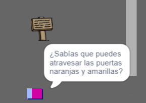

## Personas

Añade otras personas a tu mundo con las que tu objeto `jugador` puede interactuar.

\--- tarea \--- Cambia al objeto ` persona `.

 \--- /task \---

\--- tarea \--- Agrega un código al objeto `persona` para que la persona hable con el objeto` jugador `. Este código es muy similar al que has añadido a tu objeto señal de `saludo`:


```blocks3
al presionar la bandera verde
ir a x: (0) y: (-150)
por siempre 
  si <¿tocando (jugador v)? > entonces 
    decir [¿Sabías que puedes atravesar las puertas naranjas y amarillas?]
  en otro caso
    decir []
  end
end
```

\--- /task \---

\--- tarea \--- Permite que tu objeto ` persona ` se mueva añadiendo estos dos bloques en la sección ` si no ` {: class = "block3control"} de tu código:


```blocks3
al presionar la bandera verde
ir a x: (0) y: (-150)
por siempre 
  si <¿tocando (jugador v)? > entonces 
    decir [¿Sabías que puedes atravesar las puertas naranjas y amarillas?]
  en otro caso
    decir []
+       mover  (1) paso
+       si está en el borde, rebotar
  fin
fin

```

\--- /task \---

Ahora, tu objeto `persona` se moverá, pero se parará para hablar con el objeto `Jugador`.



\--- tarea \--- Agregue código a tu nuevo objeto ` persona ` para que el objeto solo aparezca en la habitación 1. El código que necesita es exactamente el mismo que el código que hace el objeto `señal` sólo sea visible en la sala 1.

Asegúrate de probar tu nuevo código. \--- /task \---