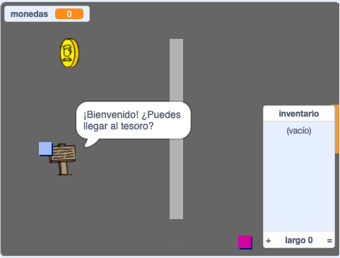

\--- no imprimir \---

This is the **Scratch 3** version of the project. There is also a [Scratch 2 version of the project](https://projects.raspberrypi.org/en/projects/create-your-own-world-scratch2).

\--- /no imprimir \---

## Introducción

In this project, you'll learn how to create your own adventure game world with multiple levels to explore.

### Lo que hará

\--- no imprimir \---

Click the green flag to start. Use the arrow keys to move your character around in the world.

  <iframe allowtransparency="true" width="485" height="402" src="https://scratch.mit.edu/projects/embed/258757783/?autostart=false" frameborder="0" scrolling="no"></iframe>
  

\--- no imprimir \---

\--- solo impresión \---

You'll use the arrow keys to move your character around in the world. 

\--- /solo impresión \---

## \--- collapse \---

## título: Lo que necesitará

### Hardware

- Una computadora capáz de hacer funcionar el Scratch 3

### Software

- Scratch 3 (ya sea [online](http://rpf.io/scratchon){:target="_blank"} u [offline](http://rpf.io/scratchoff) {:target="_blank"})

### Descargas

You can find everything you need to complete this project at [rpf.io/p/en/create-your-own-world-go](https://rpf.io/p/en/create-your-own-world-go).

\--- /collapse \---

## \--- collapse \---

## título: Lo que aprenderá

- Use conditional selection to react to key presses
- Use variables to store a game's state
- Use conditional selection based on the value of a variable
- Use lists to store data

\--- /collapse \---

## \--- collapse \---

## título: Información adicional para los formadores

Si necesitas imprimir este proyecto, usa la [versión para imprimir](https://projects.raspberrypi.org/en/projects/create-your-own-world/print){:target="_blank"}.

You can find the [completed project here](https://rpf.io/p/en/create-your-own-world-get){:target="_blank"}.

\--- /collapse \---