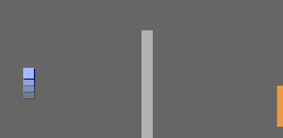

## Mueve el objeto jugador

Empieza creando un objeto `jugador` que se pueda mover por tu mundo.

\--- task \---

Abre el proyecto de inicio de Scratch "Crea tu propio mundo".

**En línea:** abre el proyecto de inicio en [rpf.io/create-your-own-world-on](http://rpf.io/create-your-own-world-on){:target="_blank"}.

Si tiene una cuenta de Scratch, puede hacer una copia haciendo clic en ** Remix **.

**Sin conexión:** descarga el proyecto de inicio desde [rpf.io/p/en/create-your-own-world-go](http://rpf.io/p/en/create-your-own-world-go) y luego ábrelo con el editor de Scratch sin conexión. Si necesitas descargar e instalar el editor offline de Scratch, puedes encontrarlo en [rpf.io/scratchoff](https://rpf.io/scratchoff){:target="_blank"}.


\--- /task \---

Al presionar las teclas de flecha se moverá al objeto `jugador`. Cuando se presiona la flecha hacia arriba, el objeto `jugador` debe moverse hacia arriba en el escenario.

\--- task \---

Añade este código al objeto `jugador`:


```blocks3
when flag clicked
forever
    if <key (up arrow v) pressed? > then
        point in direction (0)
        move (4) steps
    end
end
```

\--- /task \---

\--- task \---

Haz clic en la bandera y mantén presionada la flecha hacia arriba. ¿El objeto `jugador` se mueve hacia arriba?



\--- /task \---

\--- task \---

To move the `player` sprite to the left, you need to add another `if`{:class="block3control"} block with similar code:


```blocks3
when flag clicked
forever
    if <key (up arrow v) pressed? > then
        point in direction (0)
        move (4) steps
    end
+   if <key (left arrow v) pressed? > then
        point in direction (-90)
        move (4) steps
    end
end
```

\--- /task \---

\--- task \---

Add more code to your `player` sprite so it can move down and to the right as well. Use the code you already have to help you.

\--- hints \---

\--- hint \---

To move up, you point the `player` sprite in the direction `0` degrees. What do you have to do to move the sprite down?

To move left, you point the sprite in the direction `-90` degrees. What do you have to do to move the sprite right?

\--- /hint \---

\--- hint \---

You need to change these two blocks:


```blocks3
<key ( v) pressed>

point in direction ()
```

Duplicate the code that makes the `player` sprite move upwards, and change these two blocks to make the sprite move down. Duplicate the code again, and change it to make the sprite move to the right.

\--- /hint \---

\--- hint \---

Here is how your code should look:


```blocks3
when flag clicked
forever
    if <key (up arrow v) pressed? > then
        point in direction (0)
        move (4) steps
    end
    if <key (left arrow v) pressed? > then
        point in direction (-90)
        move (4) steps
    end

+    if <key (down arrow v) pressed? > then
        point in direction (180)
        move (4) steps
    end
+    if <key (right arrow v) pressed? > then
        point in direction (90)
        move (4) steps
    end
end
```

\--- /hint \---

\--- /hints \---

\--- /task \---