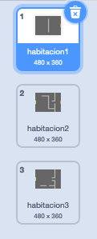
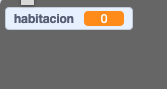
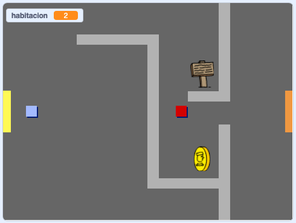

## Muévete por tu mundo

El objeto `jugador` debe ser capaz de entrar en otras habitaciones por las puertas.

Tu proyecto contiene fondos para otras habitaciones:



\--- task \---

Crea una nueva variable "para todos los objetos" y llámala `habitación`{:class="block3variables"} para poder ver en que habitación se encuentra el `jugador`.

[[[generic-scratch3-add-variable]]]



\--- /task \---

\--- task \---

Cuando el objeto `jugador` toca la puerta naranja en la primera habitación, se debe mostrar el fondo siguiente y el objeto `jugador` tiene que volver al lado izquierdo del escenario. Añade este código dentro del bucle `por siempre`{:class="block3control"} del `jugador`:


```blocks3
when flag clicked
forever
    if <key (up arrow v) pressed? > then
        point in direction (0)
        move (4) steps
    end
    if <key (left arrow v) pressed? > then
        point in direction (-90)
        move (4) steps
    end
        if <key (down arrow v) pressed? > then
        point in direction (-180)
        move (4) steps
    end
        if <key [right arrow v] pressed? > then
        point in direction (90)
        move (4) steps
    end
    if < touching color [#BABABA]? > then
    move (-4) steps
    end
+   if < touching color [#F2A24A] > then
    switch backdrop to (next backdrop v)
    go to x: (-200) y: (0)
    change [room v] by (1)
    end
end
```

\--- /task \---

\--- task \---

Cada vez que el juego empieza, la sala, la posición del personaje y el fondo necesitan ser reiniciados.

Añade código al **principio** del código del objeto `jugador` encima del bucle `por siempre`{:class="block3control"} para asegurarte que todo se restablece cuando se hace clic en la bandera:

\--- hints \---

\--- hint \---

Cuando el juego inicia:

+ El valor de `habitación`{:class="block3variables"} debe establecerse en `1`{:class="block3variables"}
+ El valor de `telón de fondo`{:class="block3looks"} debe establecerse en `habitación1`{:class="block3looks"}
+ La posición del objeto `jugador` debe establecerse en `x: -200 y: 0`{:class="block3motion"}

\--- /hint \---

\--- hint \---

Aquí están los bloques adicionales que necesitas:


```blocks3
go to x: (-200) y: (0)

set [room v] to (1)

switch backdrop to (room1 v)
```

\--- /hint \---

\--- hint \---

Así es como debería verse tu código terminado:


```blocks3
when flag clicked
+set [room v] to (1)
+go to x: (-200) y: (0)
+switch backdrop to (room1 v)
forever
    if <key (up arrow v) pressed? > then
        point in direction (0)
        move (4) steps
    end
    if <key (left arrow v) pressed? > then
        point in direction (-90)
        move (4) steps
    end
        if <key (down arrow v) pressed? > then
        point in direction (-180)
        move (4) steps
    end
        if <key [right arrow v] pressed? > then
        point in direction (90)
        move (4) steps
    end
    if < touching color [#BABABA]? > then
    move (-4) steps
    end
    if < touching color [#F2A24A] > then
    switch backdrop to (next backdrop v)
    go to x: (-200) y: (0)
    change [room v] by (1)
end
end
```

\--- /hint \---

\--- /hints \---

\--- /task \---

\--- task \---

Haz clic en la bandera y luego mueve tu objeto `jugador` hasta que toque la puerta naranja. ¿Tu objeto se mueve a la pantalla siguiente? ¿La variable `Habitación`{:class="block3variables"} cambia a `2`?



\--- /task \---