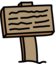

## Señales

Ahora añade señales a tu mundo para guiar a los jugadores en su viaje.

Tu proyecto incluye un objeto `seña de bienenidal`:


\--- task \---

El objeto `señal de bienvenida` solo debe ser visible en la sala 1, así que añade un poco de código al objeto para asegurarte de que esto ocurra:

\--- hints \---

\--- hint \---

`Cuando se hace clic en la bandera `{:class="block3events"}, en un bucle `para siempre`{:class="block3control"}, marca `si`{:class="block3control"} la `habitación es 1`{:class="block3variables"} y en ese caso `muestra`{:class="block3looks"} el objeto` señal de bienvenida `, `en otro caso`{:class="block3control"} `ocultar`{:class="block3looks"} el objeto.

\--- /hint \---

\--- hint \---

Aquí están los bloques que necesitas:



```blocks3
<br />if < > then
else
end

< (room :: variables) = [1] >

hide

show

forever
end

when flag clicked

```

\--- /hint \---

\--- hint \---

Aquí está el código completo:


```blocks3
when flag clicked
forever
    if < (room :: variables) = [1] > then
        show
    else
        hide
    end
end
```

\--- /hint \---

\--- /hints \---

\--- /task \---

\--- task \---

Prueba el código de tu objeto `señal de bienvenida` moviéndote entre habitaciones. Tu señal solo debe ser visible en la habitación 1.


\--- /task \---

\--- task \---

¡Una señal no es muy útil si no dice nada! Añade un poco más de código para mostrar un mensaje si el objeto `señal` es tocado por el objeto `jugador`:


```blocks3
when flag clicked
forever
if < (room :: variables) = [1] > then
show
else
hide
end
+if < touching (player v)? > then
say [Welcome! Can you get to the treasure?]
else
say []
end
end
```

\--- /task \---

\--- task \---

Prueba tu objeto `señal de bienvenida` de nuevo. Ahora deberías ver un mensaje cuando el objeto `jugador` toca el objeto `señal`.


\--- /task \---