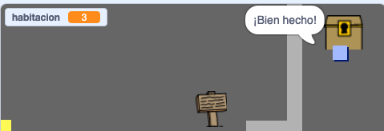

## Desafío: ¡Un tesoro!

¿Puedes añadir un tesoro para que el jugador lo encuentre?

Haz que el objeto `cofre del tesoro` solo aparezca en la habitación 3, y haz que diga '¡Bien hecho!' cuando lo toque el objeto `jugador`.

