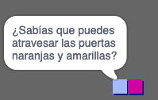

## Personas

Añade otras personas a tu mundo con las que tu objeto `jugador` pueda interactuar.

--- task ---

Cambia al objeto `persona`.


--- /task ---

--- task ---

Añade un poco de código al objeto `persona` para que la persona hable con el objeto `jugador`. Este código es muy similar al que has añadido a tu objeto `señal`:


```blocks3
when flag clicked
go to x: (0) y: (-150)
forever
    if < touching (jugador v)? > then
        say [¿Sabías que puedes pasar por puertas naranjas y amarillas?]
    else
        say []
    end
end
```

--- /task ---

--- task ---

Permite que tu objeto `persona` se mueva añadiendo estos dos bloques en la sección `si no`{:class="block3control"} de tu código:


```blocks3
when flag clicked
go to x: (0) y: (-150)
forever
    if < touching (jugador v)? > then
        say [¿Sabías que puedes pasar por puertas naranjas y amarillas?]
    else
        say []
+       move (1) steps
+       if on edge, bounce
    end
end
```

--- /task ---

Ahora, tu objeto `persona` se moverá, pero se parará para hablar con el objeto `jugador`.



--- task ---

Agrega código a tu nuevo objeto `persona` para que el objeto solo aparezca en la habitación 1. El código que necesitas es exactamente el mismo que el código que hace el objeto `señal` solo sea visible en la sala 1.

Asegúrate de probar tu nuevo código.

--- /task ---