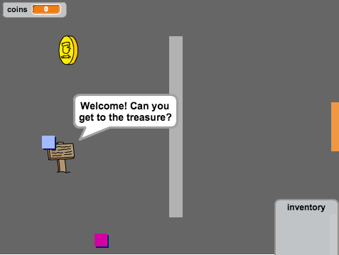

## Introducción

En este proyecto, aprenderás a crear tu propio juego de aventura el cual contará con múltiples cuartos que el jugador podrá explorar.

### Lo que se creará

Haz clic en la bandera verde para comenzar. Usa la teclas de dirección para mover a tu personaje alrededor del mundo.

  <iframe allowtransparency="true" width="485" height="402" src="https://scratch.mit.edu/projects/embed/34248822/?autostart=false" frameborder="0"></iframe>
  

### What you will learn

This project covers elements from the following strands of the [Raspberry Pi Digital Making Curriculum](http://rpf.io/curriculum){:target="_blank"}:

+ [Combine programming constructs to solve a problem.](https://www.raspberrypi.org/curriculum/programming/builder){:target="_blank"}

### Additional information for educators

If you need to print this project, please use the [printer-friendly version](https://projects.raspberrypi.org/en/projects/create-your-own-world/print){:target="_blank"}.

Use the link in the footer to access the GitHub repo for this project, which contains all resources (including an example finished project) in the `en/resources` folder.