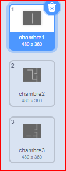
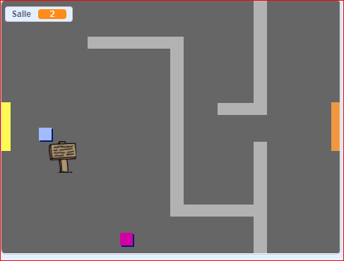

## Déplace-toi dans ton monde

Le sprite `joueur` doit être capable de marcher à travers les portes dans d'autres salles.

Ton projet contient des arrières-plans pour des salles supplémentaires :



\--- task \---

Crée une nouvelle variable 'pour toute les sprites' appelées `salle`{:class="block3variables"} pour savoir dans quelle pièce se trouve le sprite `joueur`.

[[[generic-scratch3-add-variable]]]


\--- /task \---

\--- task \---

Lorsque le joueur ` ` sprite touche la porte orange dans la première salle, le jeu devrait afficher la toile de fond suivante et le joueur ` ` le sprite doit revenir sur le côté gauche de la scène. Ajoute ce code à l'intérieur du sprite `joueur` la boucle `répéter indéfiniment` {class="block3control"}:


```blocks3
when flag clicked
forever
    if <key (up arrow v) pressed? > then
        point in direction (0)
        move (4) steps
    end
    if <key (left arrow v) pressed? > then
        point in direction (-90)
        move (4) steps
    end
        if <key (down arrow v) pressed? > then
        point in direction (180)
        move (4) steps
    end
        if <key [right arrow v] pressed? > then
        point in direction (90)
        move (4) steps
    end
    if < touching color [#BABABA]? > then
    move (-4) steps
    end
+   if < touching color [#F2A24A] > then
    switch backdrop to (next backdrop v)
    go to x: (-200) y: (0)
    change [room v] by (1)
    end
end
```

\--- /task \---

\--- task \---

Chaque fois que le jeu commence, la pièce, la position du personnage et l'arrière-plan doivent être réinitialisés.

Ajoute du code au **début** de ton code sprite `joueur` au-dessus de la boucle `répéter indéfiniment`{:class="block3control"}, pour tout réinitialiser lorsque le drapeau est cliqué:

\--- hints \---

\--- hint \---

Quand le jeu commence:

+ La valeur de `salle`{:class="block3variables"} doit être définie sur `1`{:class="block3variables"}
+ `L'arrière-plan`{:class="block3looks"} doit être définie sur `salle1`{:class="block3looks"}
+ La position du joueur ` ` l'image-objet doit être définie sur ` x: -200 y: 0 ` {: class = "block3motion"}

\--- /hint \---

\--- hint \---

Voici les blocs de code dont tu as besoin :


```blocks3
go to x: (-200) y: (0)

set [room v] to (1)

switch backdrop to (room1 v)
```

\--- /hint \---

\--- hint \---

Voici à quoi devrait ressembler ton nouveau code :


```blocks3
when flag clicked
+set [room v] to (1)
+go to x: (-200) y: (0)
+switch backdrop to (room1 v)
forever
    if <key (up arrow v) pressed? > then
        point in direction (0)
        move (4) steps
    end
    if <key (left arrow v) pressed? > then
        point in direction (-90)
        move (4) steps
    end
        if <key (down arrow v) pressed? > then
        point in direction (180)
        move (4) steps
    end
        if <key [right arrow v] pressed? > then
        point in direction (90)
        move (4) steps
    end
    if < touching color [#BABABA]? > then
    move (-4) steps
    end
    if < touching color [#F2A24A] > then
    switch backdrop to (next backdrop v)
    go to x: (-200) y: (0)
    change [room v] by (1)
end
end
```

\--- /hint \---

\--- /hints \---

\--- /task \---

\--- task \---

Clique sur le drapeau, puis déplace ton sprite `joueur` jusqu'à ce qu'il touche la porte orange. Le sprite passe-t-il à l'écran suivant? La variable `salle`{:class="block3variables"} passe-t-elle à `2`?



\--- /task \---