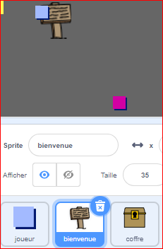
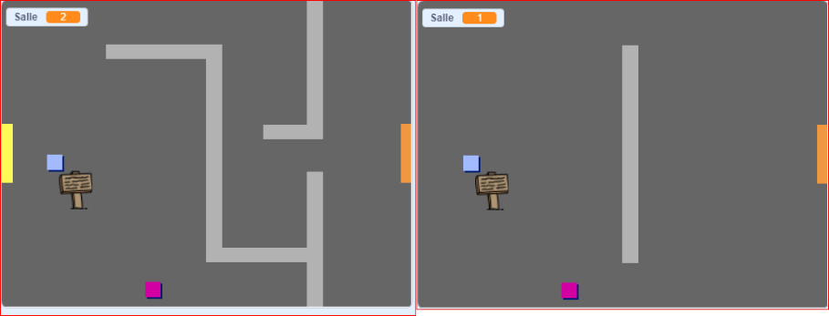
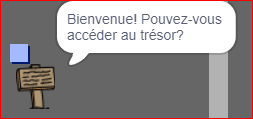

## Panneaux

Ajoute maintenant des panneaux à ton monde pour guider les joueurs dans leur voyage.

Ton project inclut un `panneau de bienvenue` sprite :



\--- task \---

Le sprite `panneau de bienvenue` ne devrait être visible que dans la salle 1, alors ajoute un code au sprite pour s'assurer que cela se passe :

\--- hints \---

\--- hint \---

`Lorsque le drapeau est cliqué`{:class="block3events"}, dans une boucle `répéter indéfiniment`{:class="block3control"}, vérifie `si`{:class="block3control"} la `salle est la première`{:class="block3variables"} et dans ce cas, `affiche`{:class="block3looks"} le sprite`panneau de bienvenue`, `sinon`{:class="block3control"} `cache`{:class="block3looks"} le sprite.

\--- /hint \---

\--- hint \---

Voici les blocs dont tu auras besoin :


```blocks3
<br />if < > then
else
end

< (room :: variables) = [1] >

hide

show

forever
end

when flag clicked

```

\--- /hint \---

\--- hint \---

Voici le code complet:


```blocks3
when flag clicked
forever
    if < (room :: variables) = [1] > then
        show
    else
        hide
    end
end
```

\--- /hint \---

\--- /hints \---

\--- /task \---

\--- task \---

Teste le code de ton sprite `panneau de bienvenue` en passant d'une salle à une autre. Le panneau ne devrait être visible que dans la salle 1.



\--- /task \---

\--- task \---

Un panneau n'est pas très bon s'il ne dit rien ! Ajoute du code supplémentaire pour afficher un message si le sprite `panneau de bienvenue` touche le sprite `du joueur`:


```blocks3
when flag clicked
forever
if < (room :: variables) = [1] > then
show
else
hide
end
+if < touching (player v)? > then
say [Welcome! Can you get to the treasure?]
else
say []
end
end
```

\--- /task \---

\--- task \---

Teste à nouveau ton sprite `panneau de bienvenue`. Tu dois maintenant voir un message lorsque le sprite `joueur` touche le sprite `panneau de bienvenue`.



\--- /task \---