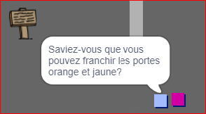

## Personnes

Ajoute d'autres personnes à ton monde avec lesquelles ton sprite `joueur` peut interagir.

\--- task \---

Change au lutin `personne`.


\--- /task \---

\--- task \---

Ajoute du code au lutin `personne`, afin que la personne parle au lutin `joueur`. Ce code est très similaire à celui que tu as ajouté à ton sprite `panneau`:


```blocks3
when flag clicked
go to x: (0) y: (-150)
forever
    if < touching (player v)? > then
        say [Did you know that you can go through orange and yellow doors?]
    else
        say []
    end
end
```

\--- /task \---

\--- task \---

Permet à ton sprite `personne` de se déplacer en ajoutant ces deux blocs à la section `sinon`{:class="block3control"} de ton code:


```blocks3
when flag clicked
go to x: (0) y: (-150)
forever
    if < touching (player v)? > then
        say [Did you know that you can go through orange and yellow doors?]
    else
        say []
+       move (1) steps
+       if on edge, bounce
    end
end
```

\--- /task \---

Ton sprite `personne` va maintenant bouger, et va s'arrêter pour parler au sprite `joueur`.



\--- task \---

Ajoute le code à ton nouveau sprite `personne` afin que ce dernier n'apparaisse que dans la salle 1. Le code dont tu as besoin est exactement le même que le code qui rend le sprite `panneau` visible seulement dans la chambre 1.

Assure-toi de tester ton nouveau code.

\--- /task \---