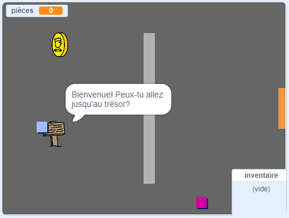

\--- no-print \---

This is the **Scratch 3** version of the project. There is also a [Scratch 2 version of the project](https://projects.raspberrypi.org/en/projects/create-your-own-world-scratch2).

\--- /no-print \---

## Introduction

In this project, you'll learn how to create your own adventure game world with multiple levels to explore.

### Ce que tu feras

\--- no-print \---

Clique sur le drapeau vert pour démarrer. Utilise les touches fléchées pour déplacer ton personnage autour le monde.

  <iframe allowtransparency="true" width="485" height="402" src="https://scratch.mit.edu/projects/embed/258757783/?autostart=false" frameborder="0" scrolling="no"></iframe>
  

\--- /no-print \---

\--- print-only \---

You'll use the arrow keys to move your character around in the world. 

\--- /print-only \---

## \--- collapse \---

## title: Ce qu'il faut avoir

### Matériel informatique

- Un ordinateur capable d'exécuter Scratch 3

### Logiciels

- Scratch 3 ( [en ligne](http://rpf.io/scratchon) ou [hors ligne](http://rpf.io/scratchoff)")

### Downloads

You can find everything you need to complete this project at [rpf.io/p/en/create-your-own-world-go](https://rpf.io/p/en/create-your-own-world-go).

\--- /collapse \---

## \--- collapse \---

## title: Ce que tu vas apprendre

- Use conditional selection to react to key presses
- Use variables to store a game's state
- Use conditional selection based on the value of a variable
- Use lists to store data

\--- /collapse \---

## \--- collapse \---

## title: Additional information for educators

Si tu as besoin d'imprimer ce projet, merci d'utiliser la [Version imprimable](https://projects.raspberrypi.org/en/projects/create-your-own-world/print) {: target = "_ blank"}.

You can find the solutions to this project at [rpf.io/p/en/create-your-own-world-get](https://rpf.io/p/en/create-your-own-world-get).

\--- /collapse \---