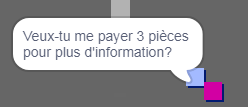
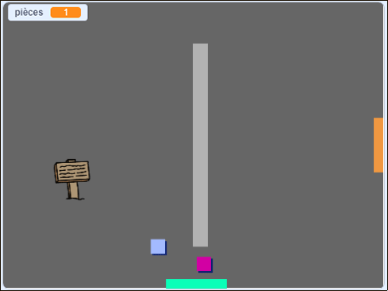

## Défi : étends ton monde

Tu peux maintenant continuer à créer ton propre monde ! Voici quelques idées :

+ Ajoute plus de pièces à ton jeu dans différentes salles. Peux-tu laisser des pièces en gardant les ennemis en patrouille?
+ Change les décors de ton jeu
+ Ajoute du son et de la musique à ton jeu
+ Ajoute plus de personnes, d'ennemis et de panneaux
+ Ajoute des portes rouges et jaunes, et des clés spéciales pour les ouvrir
+ Ajoute plus de salles à ton monde
+ Ajoute d'autres objets utiles à ton jeu
    
    + Utilise des pièces pour obtenir des informations d'autres personnes :



+ Tu pourrais même ajouter des portes dans les murs nord et sud de la salle 1, pour que le joueur puisse se déplacer d'une salle à l'autre dans les quatre directions. Par exemple, ton jeu peut avoir neuf salles dans une grille 3 × 3. Ensuite, tu peux ajouter `3` au numéro de la salle pour descendre d’un niveau.

 

```blocks3
si <touching color [ ]?> alors
change de décor pour ((costume [numéro v]) + (3))
aller à x: (0) y: (200)
changer [salle v] par (3)
```