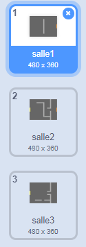
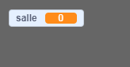
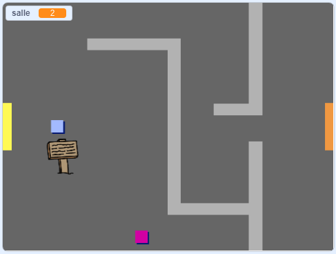

## Déplace-toi dans ton monde

Le sprite `joueur` doit être capable de marcher à travers les portes dans d'autres salles.

Ton projet contient des arrières-plans pour des salles supplémentaires :



\--- task \---

Crée une nouvelle variable 'pour toute les sprites' appelées `salle`{: class = "block3variables"} pour savoir dans quelle pièce se trouve le sprite `joueur`.

[[[generic-scratch3-add-variable]]]

 \--- /task \---

\--- task \--- Lorsque le sprite `joueur` touche la porte orange dans la première salle, le jeu devrait afficher la toile de fond suivante et le sprite `joueurs` devrait revenir à gauche de la scène. Ajouter ce code à l' intérieur du `joueur` Sprite `pour toujours`: boucle {class = "de block3control"}:


```blocks3
lorsque le drapeau a cliqué sur
pour toujours
    si la touche <(flèche haut v) est enfoncée > puis
        point dans la direction (0)
        déplacer (4) les étapes

    si <touche (flèche gauche v) est enfoncée? > puis
        point dans le sens (-90)
        déplacer (4) les étapes

        si <touche (flèche vers le bas v) est enfoncée? > puis
        point dans la direction (-180)
        déplacer (4) les étapes

        si <touches [flèche droite v] sont enfoncées? > puis
        point dans la direction (90)
        déplacer (4) les étapes

    si < couleurs touchées [#BABABA]? > puis
    déplacement (-4) les étapes

+ si < couleurs touchées [# F2A24A] > puis
    commutent la toile de fond sur (la toile de fond suivante v)
    aller sur x: (-200) y: (0)
    changement [salle v] par (1)
    fin
fin
```

\--- /task \---

\--- task \--- chaque démarrage du jeu, la pièce, la position du personnage et le fond doivent être réinitialisés.

Ajoutez du code au **début** de votre code sprite `joueur` au-dessus de la boucle `pour toujours`{: class = "block3control"}, pour tout réinitialiser lorsque vous cliquez sur le drapeau:

\--- astuces \--- \--- astuce \--- Quand le jeu commence:

+ La valeur de `room`{: class = "block3variables"} doit être définie sur `1`{: class = "block3variables"}
+ La toile de fond ``{: class = "block3looks"} doit être définie sur `room1`{: class = "block3looks"}
+ La position du `joueur` sprite doit être réglé sur `x: -200 y: 0`{: class = "block3motion"} \--- / indice \--- \--- \--- indice Voici extra les blocs dont vous avez besoin:


```blocks3
aller à x: (-200) y: (0)

régler [pièce v] à (1)

passer en fond d'écran (pièce1 v)
```

\--- / hint \--- \--- hint \--- Voici à quoi devrait ressembler votre script terminé:


```blocks3
lorsque l' indicateur cliqué
+ set [chambre v] pour (1)
+ x aller à: (-200) y: (0)
+ commutateur toile de fond (room1 v)
jamais
    si <touche (flèche v) pressé ? > puis
        point dans la direction (0)
        déplacer (4) les étapes

    si <touche (flèche gauche v) est enfoncée? > puis
        point dans le sens (-90)
        déplacer (4) les étapes

        si <touche (flèche vers le bas v) est enfoncée? > puis
        point dans la direction (-180)
        déplacer (4) les étapes

        si <touches [flèche droite v] sont enfoncées? > puis
        point dans la direction (90)
        déplacer (4) les étapes

    si < couleurs touchées [#BABABA]? > puis
    mouvement (-4) les étapes

    si < touchent la couleur [# F2A24A] > puis
    commutent la toile de fond sur (la toile de fond suivante v)
    aller à x: (-200) y: (0)
    changement [salle v ] par (1)
fin
fin
```

\--- / allusion \--- \--- / allusions \---

\--- /task \---

\--- task \--- Cliquez sur le drapeau, puis déplacez votre sprite `joueur` jusqu'à ce qu'il touche la porte orange. Le sprite passe-t-il à l'écran suivant? La variable `room`{: class = "block3variables"} passe-t-elle à `2`?

 \--- /task \---