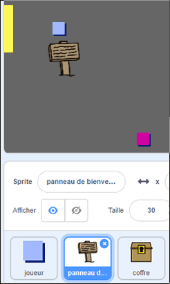
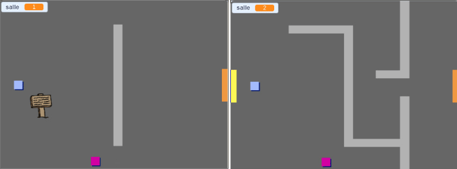
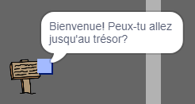

## Panneaux

Ajoute maintenant des signes à ton monde pour guider les joueurs dans leur voyage.

Ton project inclut un `panneau de bienvenue` sprite :



\--- task \--- Le sprite `panneau de bienvenue` ne devrait être visible que dans la salle 1, alors ajoute un code au sprite pour s'assurer que cela se passe :

\--- hints \--- \--- hint \--- `Lorsque le drapeau est cliqué`{:class="block3events"}, dans une boucle `répéter indéfiniment`{:class="block3control"}, vérifie `si`{:class="block3control"} la `salle est la première`{:class="block3variables"} et dans ce cas, `affiche`{:class="block3looks"} le sprite`panneau de bienvenue`, `sinon`{:class="block3control"} `cache`{:class="block3looks"} le sprite. \--- /hint \--- \--- hint \--- Voici les blocs que tu as besoin :


```blocks3
<br />si &lt; &gt; alors
sinon
end

&lt; (salle :: variables) = [1] &gt;

cacher

montrer

répéter indéfiniment
end

lorsque le drapeau est cliqué

```

\--- / hint \--- \--- hint \--- Voici le code complet:


```blocks3
lorsque le drapeau est cliqué 
répéter indéfiniment
    si < (salle :: variables) = [1] > alors
        montrer
    sinon
        cacher
end
end
```

\--- /hint \--- \--- /hints \---

\--- /task \---

\--- task \--- Teste le code de ton sprite `panneau de bienvenue` en passant d'une salle à une autre. Le panneau ne devrait être visible que dans la salle 1.

 \--- /task \---

\--- task \--- Un panneau n'est pas très bon s'il ne dit rien! Ajoute du code supplémentaire pour afficher un message si le sprite `panneau de bienvenue` touche le sprite `du joueur`:


```blocks3
lorsque le drapeau est cliqué 
répéter indéfiniment
si < (salle :: variables) = [1] > alors
    montrer
sinon
    cacher
end
+ si < touche le (joueur v)? > alors
dire [Bienvenue! Peux-tu aller au trésor?]
sinon
dire []
end
end
```

\--- /task \---

\--- task \--- Teste à nouveau ton sprite `panneau de bienvenue`. Tu dois maintenant voir un message lorsque le sprite `joueur` touche le sprite `panneau de bienvenue`.

 \--- /task \---