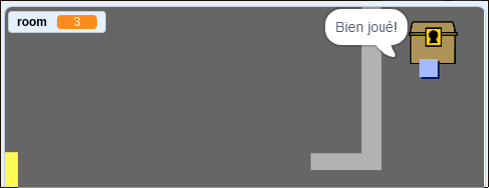

## Défi: trésor!

Peux-tu ajouter des trésors que le joueur doit trouver?

Fait apparaître le sprite `coffre à trésor` seulement dans la salle 3 et dites à ce sprite de dire "Bien joué!" quand le sprite `joueur` le touche.

