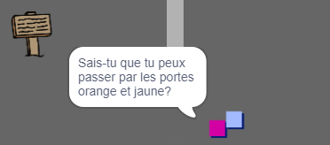

## Les personnes

Ajoute d'autres personnes à ton monde avec lesquelles ton sprite `joueur` peut interagir.

\--- task \--- Basculez vers le sprite `personne`.

 \--- /task \---

\--- task \--- Ajoute du code au sprite `personne` pour que la personne parle au sprite `joueur`. Ce code est très similaire à celui que tu as ajouté à ton sprite `panneau`:


```blocks3
lorsque le drapeau est cliqué
aller à x: (0) y: (-150)
répéter indéfiniment
    si < touché (joueur v)? > alors
        dire [Saviez-vous que vous pouvez passer par les portes orange et jaune?]
    sinon
        dire []
    fin
fin
```

\--- /task \---

\--- task \--- Permet à ton sprite `personne` de se déplacer en ajoutant ces deux blocs à la section `sinon`{:class="block3control"} de ton code:


```blocks3
lorsque le drapeau est cliqué 
aller à x: (0) y: (-150)
répéter indéfiniment
    si < touché (joueur v)? > alors
        dire [Saviez-vous que vous pouvez passer par les portes orange et jaune?]
    sinon
        dire []
+ déplacez de (1) pas
+ si sur le bord, rebondir
    fin
fin

```

\--- /task \---

Ton sprite `personne` va maintenant bouger, et va s'arrêter pour parler au sprite `joueur`.



\--- task \--- Ajoute le code à ton nouveau sprite `personne` afin que ce dernier n'apparaisse que dans la salle 1. Le code dont tu as besoin est exactement le même que le code qui rend le sprite `panneau` visible seulement dans la chambre 1.

Assure-toi de tester ton nouveau code. \--- /task \---