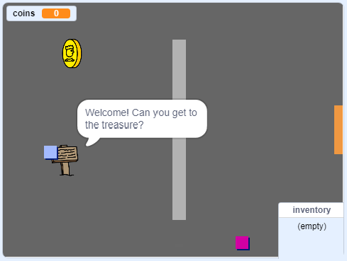

\--- no-print \---

Ovo je ** Scratch 3 ** verzija projekta. Tu je i [ Scratch 2 verzija projekta ](https://projects.raspberrypi.org/en/projects/create-your-own-world-scratch2).

\--- /no-print \---

## Uvod

U ovom projektu, naučit ćete stvoriti svoj vlastiti svijet avanturističkih igara na više razina istraživanja.

### Što ćete napraviti

\--- no-print \---

Kliknite zelenu zastavu za početak. Upotrijebite tipke sa strelicama za pomicanje svog lika po svijetu.

  <iframe allowtransparency="true" width="485" height="402" src="https://scratch.mit.edu/projects/embed/258757783/?autostart=false" frameborder="0" scrolling="no"></iframe>
  

\--- /no-print \---

\--- print-only \---

Upotrijebite tipke sa strelicama za pomicanje svog lika po svijetu. 

\--- /print-only \---

## \--- collapse \---

## naslov: Trebat ćeš

### Hardver

- Računalo koje može pokrenuti Scratch 3

### Softver

- Scratch 3 (either [online](https://rpf.io/scratchon){:target="_blank"} or [offline](https://rpf.io/scratchoff){:target="_blank"})

### Preuzimanja

Sve što je potrebno za dovršavanje ovog projekta možete pronaći na [ rpf.io/p/en/create-your-own-world-go ](https://rpf.io/p/en/create-your-own-world-go).

\--- /collapse \---

## \--- collapse \---

## naslov: Naučit ćeš

- Upotrijebiti uvjetni odabir da biste reagirali na pritiske tipki
- Koristiti varijable za spremanje stanja igre
- Koristiti uvjetni odabir na temelju vrijednosti varijable
- Upotrijebiti liste za pohranu podataka

\--- /collapse \---

## \--- collapse \---

## naslov: Dodatne informacije za edukatore

Ako trebate ispisati ovaj projekt, koristite [printer-friendly version](https://projects.raspberrypi.org/en/projects/create-your-own-world/print){:Target="_ blank"}.

Dovršen projekt možete pronaći [ovdje](https://rpf.io/p/en/create-your-own-world-get){:target="_blank"}.

\--- /collapse \---