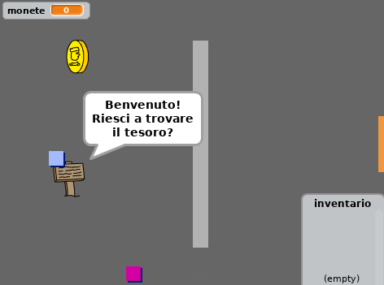

## Introduzione

In questo progetto, imparerai come creare il tuo gioco di avventura in cui il giocatore dovrà esplorare più stanze.

### Cosa creerai

Clicca sulla bandiera verde per cominciare. Usa i tasti freccia per muovere il tuo personaggio in giro per il mondo.

  <iframe allowtransparency="true" width="485" height="402" src="https://scratch.mit.edu/projects/embed/34248822/?autostart=false" frameborder="0"></iframe>
  

### Cosa imparerai

Questo progetto include elementi tratti dalle seguenti componenti del [Digital Making Curriculum di Raspberry Pi](http://rpf.io/curriculum){:target="_blank"}:

+ [Combinare i costrutti di un linguaggio di programmazione per risolvere un problema.](https://www.raspberrypi.org/curriculum/programming/builder){:target="_blank"}

### Ulteriori informazioni per gli educatori

Se intendete stampare questo progetto, cliccate su [Versione stampabile](https://projects.raspberrypi.org/en/projects/create-your-own-world/print){:target="_ blank"}.

Cliccare il link a piè di pagina per accedere alla repository di GitHub relativa a questo progetto, che contiene tutte le risorse necessarie (incluso un esempio di progetto completo) nella cartella `en/resources`.