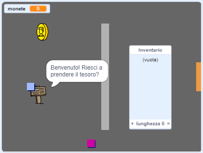

\--- no-print \---

Questa è la versione **Scratch 3** del progetto. C'è anche una versione [Scratch 2 del progetto](https://projects.raspberrypi.org/en/projects/create-your-own-world-scratch2).

\--- /no-print \---

## Introduzione

In questo progetto, imparerai come creare il tuo gioco di avventura in cui il giocatore dovrà esplorare molte stanze.

### Che cosa creerai

\--- no-print \---

Clicca sulla bandiera verde per cominciare. Usa i tasti freccia per muovere il tuo personaggio in giro per il mondo.

  <iframe allowtransparency="true" width="485" height="402" src="https://scratch.mit.edu/projects/embed/258757783/?autostart=false" frameborder="0" scrolling="no"></iframe>
  

\--- /no-print \---

\--- print-only \---

Usa i tasti freccia per muovere il tuo personaggio in giro per il mondo. 

\--- /print-only \---

## \--- collapse \---

## title: Di cosa avrete bisogno?

### Hardware

- Un computer in grado di eseguire Scratch 3

### Software

- Scratch 3 ([online](http://rpf.io/scratchon){:target="_blank"} o [offline](http://rpf.io/scratchoff){:target="_blank"}"})

### Downloads

Puoi trovare tutto il necessario per completare questo progetto su [ rpf.io/p/en/create-your-own-world-go ](https://rpf.io/p/en/create-your-own-world-go).

\--- /collapse \---

## \--- collapse \---

## title: Cosa imparerai

- Utilizzare la selezione condizionale per reagire alla pressione dei tasti
- Usa le variabili per memorizzare lo stato di un gioco
- Utilizzare la selezione condizionale in base al valore di una variabile
- Usare liste per memorizzare i dati

\--- / chiudi \---

## \--- collapse \---

## title: Informazioni aggiuntive per gli educatori

Se intendete stampare questo progetto, cliccate su [Versione stampabile](https://projects.raspberrypi.org/en/projects/create-your-own-world/print){:target="_ blank"}.

Puoi trovare il [progetto completo qui](https://rpf.io/p/en/create-your-own-world-get){:target="_blank"}.

\--- / chiudi \---