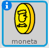

## Raccogliere monete

Durante i suoi spostamenti all'interno del mondo, il tuo sprite `giocatore` può raccogliere alcune monete.

+ Aggiungi una nuova variabile chiamata `monete`{:class="blockdata"} al tuo progetto.

+ Fai click con il tasto destro del mouse sullo sprite `moneta` e scegli **mostra**.



+ Aggiungi del codice allo sprite `moneta` per far sì che appaia solo nella stanza 1.

+ Aggiungi del codice allo sprite `moneta` per far sì che `1` venga aggiunto alle variabile `monete`{:class="blockdata"} una volta che lo sprite `giocatore ` tocca lo sprite `moneta` per "raccoglierlo".
    
    ```blocks
        quando si clicca su ⚑
    	attendi fino a quando < sta toccando [giocatore v]>
    	cambia [monete v] di (1)
    	ferma [tutti gli altri script dello sprite v]
    	nascondi
    ```
    
    Il codice `ferma tutti gli altri script dello sprite`{:class="blockcontrol"} è necessario affinchè lo sprite `moneta` smetta di essere visualizzato nella stanza 1 una volta che è stato raccolto.

+ Dovrai anche aggiungere del codice per impostare la tua variabile `monete`{:class="blockdata"} al valore `0` all'inizio del tuo gioco.

+ Prova il tuo progetto: raccogliere una moneta dovrebbe portare il valore delle tue `monete` a `1`.

\--- challenge \---

### Sfida: ancora più monete

Puoi aggiungere altre monete al tuo gioco? Possono trovarsi in stanze diverse e alcune monete potrebbero persino essere sorvegliate dai nemici che pattugliano!

\--- /challenge \---