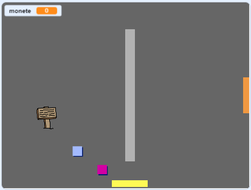

## Sfida: espandi il tuo mondo

Ora puoi continuare a creare il tuo mondo! Ecco alcune idee:

+ Aggiungi più monete al tuo gioco in stanze diverse. Puoi lasciare che alcune monete siano sorvegliate da pattuglie avversarie?
+ Cambia gli sfondi del tuo gioco
+ Aggiungi suoni e musica al tuo gioco
+ Aggiungi più persone, nemici, messaggi e monete
+ Aggiungi porte rosse e gialle e chiavi speciali per aprirle
+ Aggiungi più stanze al tuo mondo
+ Aggiungi altri oggetti utili al tuo gioco
    
    + Usa le monete per ottenere informazioni dalle altre persone:


+ Potresti persino aggiungere porte nelle pareti nord e sud della stanza 1, in modo che il giocatore possa spostarsi tra le stanze in tutte e quattro le direzioni. Ad esempio, il tuo gioco può avere nove stanze in una griglia 3 × 3. Potresti quindi aggiungere `3` al numero delle stanze per scendere di un livello.




```blocks3
se <touching color [ ]?> allora 
 passa allo sfondo ((costume [number v]) + (3))
 vai a x: (0) y: (200)
 cambia [stanza v] di (3)
end
```