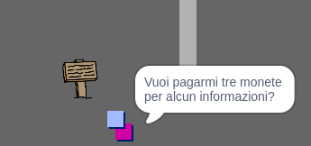

\--- challenge \---

## Sfida: espandi il tuo mondo

Ora puoi continuare a creare il tuo mondo! Ecco alcune idee:

+ Cambia le impostazioni del gioco e modificane la grafica
+ Aggiungi suoni e musica al tuo gioco
+ Aggiungi più persone, nemici, messaggi e monete
+ Aggiungi porte rosse e gialle e chiavi speciali per aprirle
+ Aggiungi più stanze al tuo mondo
+ Aggiungi altri oggetti utili al tuo gioco

+ Usa le monete per ottenere informazioni dalle altre persone:

+ Potresti persino aggiungere porte nelle pareti nord e sud della stanza 1, in modo che il giocatore possa spostarsi tra le stanze in tutte e quattro le direzioni. Ad esempio, se avessi nove stanze, potresti disporle come una griglia 3×3. Potresti quindi aggiungere `3` al numero delle stanze per scendere di un livello.

\--- /challenge \---