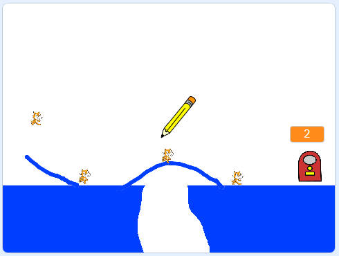

## E poi?

Vai alla creazione di un altro gioco lavorando sul progetto [GATTI!](https://projects.raspberrypi.org/it-IT/projects/cats?utm_source=pathway&utm_medium=whatnext&utm_campaign=projects).

--- no-print ---

Clicca e trascina per tracciare una linea con la matita con il mouse. Il tuo obiettivo è quello di impedire ai gatti di cadere in buche creando un percorso sicuro verso l'uscita.

  <iframe allowtransparency="true" width="485" height="402" src="https://scratch.mit.edu/projects/embed/253667883/?autostart=false" frameborder="0" scrolling="no"></iframe>

--- /no-print ---

--- print-only ---

--- /print-only ---

Se vuoi fare un gioco usando Python invece di Scratch, prova il progetto [RPG](https://projects.raspberrypi.org/it-IT/projects/rpg?utm_source=pathway&utm_medium=whatnext&utm_campaign=projects).

***
Questo progetto è stato tradotto da volontari:

Alessandro Mandelli

Omar Lazzari

Silvia Caponio

Grazie ai volontari, possiamo offrire alle persone di tutto il mondo la possibilità di imparare nella loro lingua. Puoi aiutarci a raggiungere più persone offrendoti come volontario per la traduzione - puoi trovare maggiori informazioni su [rpf.io/translate](https://rpf.io/translate).