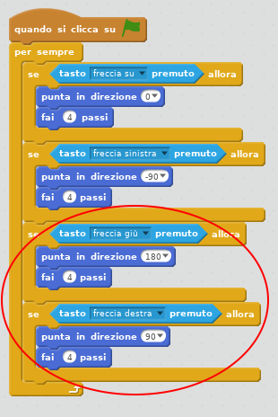

## Spostare lo sprite del `giocatore`

Inizia creando uno sprite `giocatore` che possa muoversi nel tuo mondo.

+ Se stai utilizzando Scratch online, apri il progetto Scratch "Crea il tuo mondo" su <http://jumpto.cc/world-go>{:target="_blank"}. Se stai utilizzando Scratch offline, scarica il progetto [da qui](http://jumpto.cc/world-get){: target = "_ blank"}, e aprilo utilizzando l'editor offline. 


La persona che gioca userà i tasti freccia per spostare lo sprite `giocatore`. Quando la persona preme la freccia "su", devi dire allo sprite `giocatore` di spostarsi verso l'alto, in modo che vada nella giusta direzione.

+ Aggiungi questo codice allo sprite `giocatore`:

```blocks
    quando si clicca su ⚑
    per sempre 
        se <tasto [freccia su v] premuto > allora
            punta in direzione (0)
            fai (4) passi 
        fine
    fine
```

+ Metti alla prova il tuo sprite `giocatore` facendo click sulla bandierina verde e tenendo premuta la freccia "su". Il tuo sprite `giocatore` si muove verso l'alto?
    
    

+ Per spostare lo sprite `giocatore` a sinistra, è necessario aggiungere un altro blocco `se`{:class="blockcontrol"} con un codice simile a quello precedente:

```blocks
    quando si clicca su ⚑
    per sempre 
        se <tasto [freccia su v] premuto > allora
            punta in direzione (0)
            fai (4) passi 
        fine
        se <tasto [freccia sinistra v] premuto > allora
            punta in direzione (-90)
            fai (4) passi 
        fine
    fine
```

+ Aggiungi altro codice al tuo sprite `giocatore` in modo che possa muoversi anche verso destra e verso il basso. Usa il codice che hai già per aiutarti.

\--- hints \--- \--- hint \--- Per spostarti verso l'alto, hai puntato lo sprite `giocatore` in direzione `0` gradi. Cosa dovresti fare per spostare lo sprite verso il basso?

Per spostarti a sinistra, hai puntato lo sprite in direzione `-90` gradi. Cosa dovresti fare per spostare lo sprite verso destra? \--- /hint \--- \--- hint \--- Dovrai cambiare questi due blocchi:

```blocks
<tasto [ v] premuto>
```

```blocks
punta in direzione (0)
```

Duplica il codice che hai usato per salire, ma cambia questi due blocchi per far sì che lo sprite `giocatore` si sposti verso il basso. Fai lo stesso per spostarti a destra. \--- /hint \--- \--- hint \--- Ecco come dovrebbe apparire il tuo codice:

 \--- /hint \--- \--- /hints \---