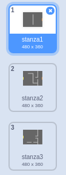

## Segnali

Lo sprite `player` dovrebbe essere in grado di raggiungere altre stanze attraversando le porte.

Il tuo progetto contiene sfondi per ulteriori stanze:



\--- task \---

Crea una nuova variabile valida 'per tutti gli sprite' chiamata `stanza`{:class="blockdata"}, per definire in quale stanza si trova lo sprite `player`.

[[[generic-scratch3-add-variable]]]


\--- /task \---

\--- task \---

When the `player` sprite touches the orange door in the first room, the game should display the next backdrop, and the `player` sprite should move back to the left side of the Stage. Add this code inside the `player` sprite's `forever`{:class="block3control"} loop:


```blocks3
quando si clicca sulla bandiera verde
per sempre 
  se <tasto (freccia su v) premuto? > allora 
    punta in direzione (0)
    fai (4) passi
  end
  se <tasto (freccia sinistra v) premuto? >allora 
    punta in direzione (-90)
    fai (4) passi
  end
  se <tasto (freccia giu v) premuto? >allora 
    punta in direzione (-180)
    fai (4) passi
  end
  se <tasto [freccia destra v] premuto? > allora 
    punta in direzione (90)
    fai (4) passi
  end
  se < sta toccando il colore [#BABABA]? > then
    move (-4) steps
    end
+   if < touching color [#F2A24A] > then
    switch backdrop to (next backdrop v)
    go to x: (-200) y: (0)
    change [room v] by (1)
    end
end
```

\--- /task \---

\--- task \---

Every time the game starts, the room, character position, and backdrop need to be reset.

Add code to the **start** of your `player` sprite code above the `forever`{:class="block3control"} loop, to reset everything when the flag is clicked:

\--- hints \---

\--- hint \---

When the game starts:

+ Il valore di `stanza`{:class="block3variabili"} dovrebbe essere impostato a `1`{:class="block3variabili"}
+ Lo `sfondo` {:class="block3looks"} dovrebbe essere impostato su ` stanza1 ` {:class="block3looks"}
+ The position of the `player` sprite should be set to `x: -200 y: 0`{:class="block3motion"}

\--- /hint \---

\--- hint \---

Here are the extra blocks you need:


```blocks3
vai a x: (-200) y: (0)

porta [stanza v] a (1)

passa allo sfondo (stanza1 v)
```

\--- /hint \---

\--- hint \---

Here's what your finished script should look like:


```blocks3
quando si clicca sulla bandiera verde
+porta [stanza v] a (1)
+vai a x: (-200) y: (0)
+passa allo sfondo (stanza1 v)
per sempre 
se <tasto (freccia su v) premuto? > allora 
    punta in direzione (0)
    fai (4) passi
  end
  se <tasto (freccia sinistra v) premuto? >allora 
    punta in direzione (-90)
    fai (4) passi
  end
  se <tasto (freccia giu v) premuto? >allora 
    punta in direzione (-180)
    fai (4) passi
  end
  se <tasto [freccia destra v] premuto? > allora 
    punta in direzione (90)
    fai (4) passi
  end
  se < sta toccando il colore [#BABABA]? > allora 
    fai (-4) passi
  end
  se < sta toccando il colore [#F2A24A]> allora 
    passa allo sfondo (next backdrop v)
    vai a x: (-200) y: (0)
    cambia [stanza v] di (1)
  end
end
```

\--- /hint \---

\--- /hints \---

\--- /task \---

\--- task \---

Click the flag, and then move your `player` sprite until it touches the orange door. Does the sprite move to the next screen? Does the `room`{:class="block3variables"} variable change to `2`?


\--- /task \---