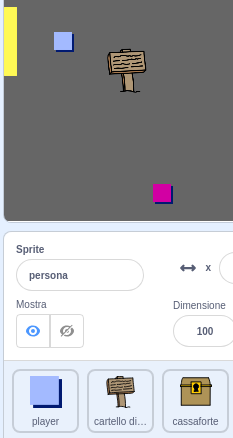
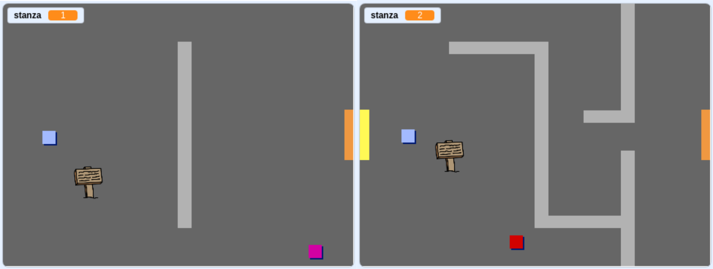
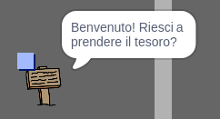

## Cartelli

Aggiungiamo cartelli al tuo mondo per guidare il giocatore nel suo viaggio.

Il tuo progetto contiene uno sprite `cartello di benvenuto`:



\--- task \--- The `welcome sign` sprite should only be visible in room 1, so add some code to the sprite to make sure that this happens:

`Quando la bandiera verde viene cliccata`{:class="block3events"}, continua a guardare `per sempre`{:class="block3control"} `se`{:class="block3control"} la `stanza è 1`{:class="block3sensing"}, ed in quel caso mostra `cartello di benvenuto`{:class="block3control"}, `altrimenti`{:class="block3control"} `nascondi`{:class="block3looks"} lo sprite. \--- /hint \--- \--- hint \--- Qui ci sono i blocchi di codice che ti serviranno:


```blocks3
<br />if &lt; &gt; then
else
end

&lt; (room :: variables) = [1] &gt;

hide

show

forever
end

when flag clicked

```

\--- /hint \--- \--- hint \--- Ecco il codice completo:


```blocks3
when flag clicked
forever
    if < (room :: variables) = [1] > then
        show
    else
        hide
    end
end
```

\--- /hint \--- \--- /hints \---

\--- /task \---

\--- task \--- Metti alla prova il tuo sprite `cartello di benvenuto` muovendoti tra le stanze. Il tuo cartello dovrebbe essere visibile solo nella stanza 1.

 \--- /task \---

\--- task \--- Un cartello non è molto utile se non dice nulla! Aggiungi del codice per far visualizzare un messaggio se lo sprite `cartello di benvenuto` sta toccando lo sprite `giocatore`:


```blocks3
when flag clicked
forever
if < (room :: variables) = [1] > then
show
else
hide
end
+if < touching (player v)? > then
say [Benvenuto! Riesci a raccogliere il tesoro?]
else
say []
end
end
```

\--- /task \---

\--- task \--- Prova di nuovo il tuo sprite `cartello di benvenuto`. Ora dovresti vedere un messaggio quando lo sprite ` player ` tocca il ` cartello di benvenuto`.

 \--- /task \---