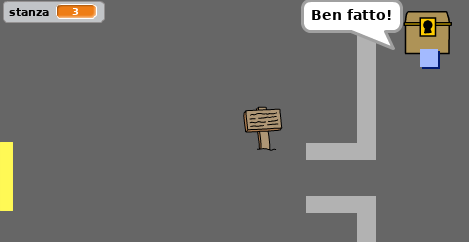

\--- challenge \---

## Sfida: tesoro!

Sapresti aggiungere un tesoro da far trovare al giocatore?

Crea lo sprite `tesoro`. Fai in modo che appaia solo nella stanza 3, e dica "Ben fatto!" quando lo sprite `giocatore` lo tocca.

\--- /challenge \---