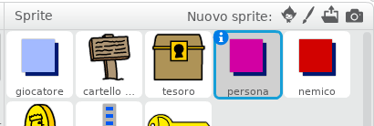

## Persone

Aggiungiamo altre persone al tuo mondo con cui il tuo sprite `giocatore` possa interagire.

+ Seleziona lo sprite `persona`.



+ Aggiungi del codice allo sprite `persona`, per far sì che la persona parli con lo sprite `giocatore`. Questo codice è molto simile al codice che hai aggiunto al tuo sprite `cartello di benvenuto`:

```blocks
    quando si clicca su ⚑
	vai a x: (0) y: (-150)
	per sempre 
	  se < sta toccando [giocatore v] > allora 
		dire [Lo sai che puoi passare attraverso le porte arancioni e gialle?]
	  altrimenti 
		dire []
	  fine
	fine
```

+ Puoi anche consentire allo sprite `persona` di spostarsi aggiungendo questi due blocchi nella sezione `altrimenti`{:class="blockcontrol"} del tuo codice:

```blocks
fai (1) passi
rimbalza quando tocchi il bordo
```

Il tuo sprite `persona` ora si muoverà, ma si fermerà per parlare con lo sprite `giocatore`.


\--- challenge \---

### Sfida: migliorare la persona

Sapresti aggiungere del codice alla sprite `persona` per far sì che compaia solo nella stanza 1? Assicurati di testare il tuo nuovo codice.

\--- /challenge \---