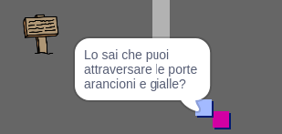

## Persone

Aggiunge persone al tuo mondo con le quali il tuo sprite `player` possa interagire.

\--- task \--- Seleziona lo sprite `persona`.

 \--- /task \---

\--- task \--- Aggiungi del codice allo sprite `persona`, per far sì che la persona parli con lo sprite `giocatore`. Questo codice è molto simile al codice che hai aggiunto al tuo sprite `cartello di benvenuto`:


```blocks3
when flag clicked
go to x: (0) y: (-150)
forever
    if < touching (giocatore v)? > then
        say [Lo sapevi che puoi attraversare le porte arancioni e gialle?]
    else
        say []
    end
end
```

\--- /task \---

Puoi anche consentire allo sprite `persona` di spostarsi aggiungendo questi due blocchi nella sezione `altrimenti`{:class="blockcontrol"} del tuo codice:


```blocks3
quando si clicca sulla bandiera verde
vai a x: (0) y: (-150)
per sempre 
  se < sta toccando (giocatore v)? > allora 
    dire [Lo sapevi che puoi attraversare le porte arancioni e gialle?]
  altrimenti 
    dire []
    + fai (1) passi
    + rimbalza quando tocchi il bordo
  end
end

```

\--- /task \---

Il tuo sprite `persona` ora si muoverà, ma si fermerà per parlare con lo sprite `giocatore`.



\--- task \--- Aggiungi il codice alla tua nuova `persona` in modo che lo sprite appaia solo nella stanza 1. Il codice di cui hai bisogno è esattamente lo stesso che rende visibile lo sprite `cartello di benvenuto` solo nella stanza 1.

Assicurati di testare il tuo nuovo codice. \--- /task \---