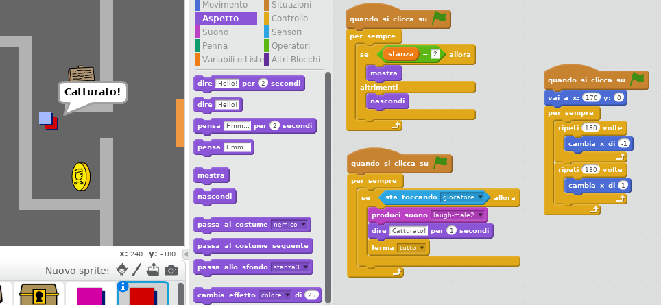

\--- challenge \---

## Sfida: aggiungi un nemico

Puoi anche aggiungere una pattuglia di nemici. Se il giocatore tocca un nemico, il gioco finisce.

+ Aggiungi del codice allo sprite `nemico` per far sì che appaia solo nella stanza 2.

+ Aggiungi del codice per far muovere lo sprite `nemico` e per far terminare il gioco se lo sprite `nemico` tocca lo sprite `giocatore`. È più facile farlo in blocchi di codice separati. Ecco come il codice del tuo sprite `nemico` potrebbe apparire:

+ + Sia visibile solo nella stanza 2
    + Pattugli la stanza
    + Il gioco termini se lo sprite `giocatore` lo tocca

\--- /challenge \---

\--- challenge \---

## Sfida: più nemici

Sapresti creare un altro sprite `nemico` nella stanza 3 che pattugli su e giù attraverso lo spazio nel muro?

\--- /challenge \---