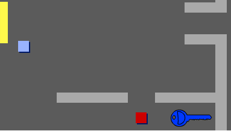

## ドアとキー

次に、コード（プログラム）を追加してあなたのゲームの世界のドア（一部）に鍵をかけられるようにします。プレイヤーはドアを開けて次の部屋へ進むために鍵をみつける必要があります。

--- task ---

`かぎ`のスプライトを選んでください。 スクリプトメニューの `表示`{:class="blocklooks"}をクリックすると、ステージにスプライトが表示されます。

--- /task ---

--- task ---

`キー` スプライトのコスチュームを編集して青になるようにします。

--- /task ---

--- task ---

ステージの背景を部屋3に切り替え、 `キー` のスプライトを手の届きにくい場所に配置します。



--- /task ---

--- task ---

`キー` スプライトにコードを追加して、部屋3でのみ表示されるようにします。

--- /task ---

--- task ---

`インベントリ`{:class="block3variables"}という新しいリストを作成して、 `プレイヤー` のスプライトが収集するアイテムを保存するようにします。

[[[generic-scratch3-make-list]]]

--- /task ---

--- task ---

キーを収集するために追加する必要のあるコードは、コインを収集するためのコードととてもよく似ています。 違いは `インベントリ`{:class="block3variables"}にキーを追加することです。


```blocks3
when flag clicked
wait until <touching (プレイヤー v)?>
add [あおいろのかぎ] to [アイテムいちらん v]
hide
stop [スプライトの他のスクリプトを停止する v]
```

--- /task ---

--- task ---

ステージにコードを追加して、ゲームの開始時にインベントリを空にします。

```blocks3
delete all of [アイテムいちらん v]
```

--- /task ---

--- task ---

ゲームをテストして、 `キー` のスプライトを集めてインベントリに追加できるかどうかを確認しましょう。

--- /task ---

--- task ---

次に、ロックされたドアを追加します。 `青いドア` スプライトを選択し、「スクリプト」メニューの[ `表示`{class="blocklooks}]をクリックして、2つの壁の間の谷間にスプライトを配置します。


--- /task ---

--- task ---

部屋3でのみ表示されるように、 `青いドア` スプライトにコードを追加します。

--- /task ---

--- task ---

`青いドア` スプライトにコードを追加して、キーが `インベントリ`{:class="block3variables"}の中にある場合、スプライトを `非表示`{:class="block3looks"}にして、 `プレーヤー` スプライトが通過できるようにします。


```blocks3
when flag clicked
wait until <[アイテムいちらん v] contains [あおいろのかぎ]?>
stop [スプライトの他のスクリプトを停止する v]
hide
```

--- /task ---

--- task ---

ゲームをテストして、ドアを開けるために、青いキーを集めることができるかどうか確認してください。

--- /task ---