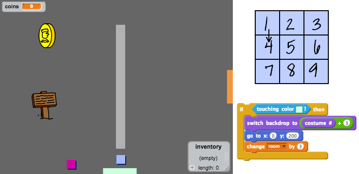

\---挑戦\---

## 課題：あなたの世界を広げる

あなたは自分の世界を作り続けることができます！ ここにいくつかのアイデアがあります：

+ ゲームの設定を変更し、ゲームのグラフィックスを変更する
+ サウンドと音楽をゲームに追加する
+ より多くの人、敵、看板、コインを追加する
+ 赤と黄色の扉と特別なキーを追加して開きます
+ あなたの世界にもっと多くの部屋を追加
+ 他の便利なアイテムをゲームに追加する

+ コインを使って他の人から情報を入手する：

+ 部屋1の北と南の壁にドアを追加することもでき、プレイヤーは4方向すべての部屋を移動できます。 たとえば、9つの部屋がある場合、それらを3×3グリッドにすると考えることができます。 部屋番号に `3` を追加して1つ下の階層に移動できます。

\--- /チャレンジ\---