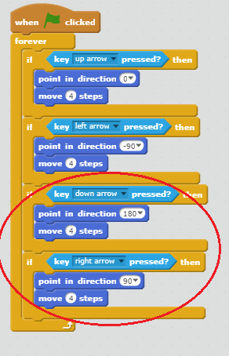

## 移動 `プレイヤー` スプライトを

あなたの世界を動かすことができる `プレイヤー` スプライトを作成しましょう。

+ Scratchをオンラインで使用している場合、 <http://jumpto.cc/world-go>{{target = "_ blank"}で「自分の世界を作成する」スクラッチプロジェクトを開きます。 Scratchをオフラインで使用している場合は、プロジェクト [ここ](http://jumpto.cc/world-get){{target = "_ blank"}でダウンロードし、オフラインエディタを使用して開きます。 


ゲームをプレイしている人は矢印キーを使って `プレイヤー` スプライトを移動させます。 人が上向きの矢印を押すと、 `プレイヤーに` スプライトが上に移動するように指示する必要があります。その結果、右の方向に移動します。

+ このコードを `プレイヤーに追加する` スプライト：

```blocks
    
    永久にクリックしたとき
 <キー[上向き矢印v]が押された場合
 ？ > 場合は
            方向（0）
            移動（4）のステップ
        終了
    終了
```

+ フラグをクリックして上向き矢印を押しながら、あなたの `プレイヤー` スプライトをテストします。 あなたの `プレイヤー` スプライトは上がっていますか？
    
    

+ プレーヤー `` スプライトを左に移動するには、</code>{：class = "blockcontrol"}ブロックに同様のコードを使用する場合は、別の `を追加する必要があります。</p></li>
</ul>

<pre><code class="blocks">    
    永久にクリックしたとき
 <キー[上向き矢印v]が押された場合
 ？ > 方向に
            点移動（0）
            移動（4）手順
        終了
 <キー[左矢印v]を押すと？ >
            方向（-90）
            移動（4）ステップ
        エンド
    エンド
`</pre> 
    
    + あなたの `プレイヤー` スプライトにさらにコードを追加して、彼らが右下に移動できるようにします。 すでに必要なコードを使用してください。
    
    \---ヒント\--- \---ヒント\--- \--- に移動するには、 `プレイヤー` スプライトが `0` 度の方向を指していたとします。 スプライトを動かすためにあなたは何をしなければなりませんか？
    
    左に移動するには、方向のスプライトを指摘 `-90` 度。 あなたはスプライトを正しく動かすために何をしなければなりませんか？ \--- /ヒント\--- \---ヒント\--- \--- これらの2つのブロックを変更する必要があります：
    
    ```blocks
    <key [ v] pressed>
    ```
    
    ```blocks
    方向を指す（）
    ```
    
    上がっていたコードを複製しますが、これらの2つのブロックを変更して `プレーヤー` スプライトを下に移動させます。 右に動いても同じことをしてください。 \--- / hint \--- \--- hint \--- あなたのコードがどのように見えるかは次のとおりです：
    
     \--- /ヒント\--- \--- /ヒント\---