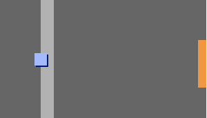

## 堅い壁

\--- task \--- `プレイヤー` スプライトをもう一度テストします。 あなたはそれが薄灰色の壁を通って歩くことができるのを見ますか。

 \--- /task \---

\--- task \--- これを直すには、 `プレイヤー` スプライトが薄い灰色の壁に触れたらそれを後ろに移動させる必要があります。 ここでは、あなたの内側に追加する必要があるコードです `永遠に`{：クラス=「block3control」}方向ブロック下のブロックは：


```blocks3
<キー（上向き矢印v）が押されたらフラグが永久に
クリックしたとき
 > 次に方向
        指す（0）
        移動する（4）ステップ
    終了
 <キー（左矢印v）を押すと？ > から
        方向に
ポイント（-90）
        移動（4）ステップ
    終了
 <キー（下矢印v）が押されたら > そして
        方向を向く（-180）
        移動する（4）ステップ
    終了
 <キー[右矢印v]を押すと？ > その後
        方向を指す（90）
        移動する（4）ステップ
    終了
+ < [ < ]色に触れた場合、 > から
    移動（-4）ステップ
    終了
終了
```

\--- /task \---

\--- task \---

`プレイヤー` スプライトが壁を通過するようにしてください。 新しいコードが機能すれば、これは不可能なはずです。

 \--- /task \---