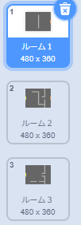
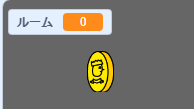
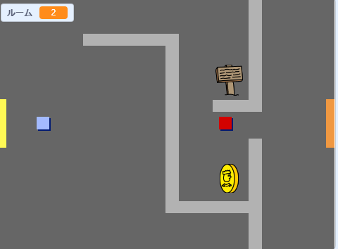

## あなたの「世界」の中を動き回ろう

`プレイヤー` スプライトはドアを通って他の部屋に入ることができるはずです。

あなたのプロジェクトには追加の部屋の背景が含まれています。



--- task ---

`ルーム`{:class="block3variables"}という新しい `スプライト全体` 変数を作成して、 `プレーヤー` スプライトがどの部屋にいるかを追跡できるようにしましょう。

[[[generic-scratch3-add-variable]]]



--- /task ---

--- task ---

`プレーヤー` スプライトが最初の部屋のオレンジ色のドアに触れると、ゲームは次の背景を表示し、 `プレーヤー` スプライトはステージの左側に戻るはずです。 以下のコードを`プレイヤー` スプライトの `無限ループ`{:class="block3control"}の中にを追加します。


```blocks3
when flag clicked
forever
	if <key (上向き矢印 v) pressed? > then
		point in direction (0)
		move (4) steps
	end
	if <key (左矢印 v) pressed? > then
		point in direction (-90)
		move (4) steps
	end
		if <key (下矢印 v) pressed? > then
		point in direction (180)
		move (4) steps
	end
		if <key [右矢印 v] pressed? > then
		point in direction (90)
		move (4) steps
	end
	if < touching color [#BABABA]? > then
	move (-4) steps
	end
+	if < touching color [#F2A24A] > then
	switch backdrop to (next backdrop v)
	go to x: (-200) y: (0)
	change [ルーム v] by (1)
	end
end
```

--- /task ---

--- task ---

ゲームが始まるたびに、ルーム、キャラクターの位置、背景がリセットされる必要があります。

フラグがクリックされたときにすべてをリセットするには、 `プレーヤー` スプライトコードの**開始** 部分（ただし`無限ループ`{:class="block3control"}の上）にコードを追加します。

--- hints --- 

--- hint ---

ゲーム起動時：

+ `ルーム`{:class="block3variables"}の値は、 `1`{:class="block3variables"}に設定する必要があります。
+ `背景`{:class="block3looks"}を `room1`{:class="block3looks"}に設定します。
+ `プレイヤー` スプライトの位置は `x: -200 y: 0`{:class="block3motion"}に設定する必要があります

--- /hint ---

--- hint ---

必要なコードブロックは次のとおりです。


```blocks3
go to x: (-200) y: (0)

set [ルーム v] to (1)

switch backdrop to (ルーム1 v)
```

--- /hint --- 

--- hint ---

完成したコードは次のようになっているはずです。


```blocks3
when flag clicked
+set [ルーム v] to (1)
+go to x: (-200) y: (0)
+switch backdrop to (ルーム1 v)
forever
	if <key (上向き矢印 v) pressed? > then
		point in direction (0)
		move (4) steps
	end
	if <key (左矢印 v) pressed? > then
		point in direction (-90)
		move (4) steps
	end
		if <key (下矢印 v) pressed? > then
		point in direction (180)
		move (4) steps
	end
		if <key [右矢印 v] pressed? > then
		point in direction (90)
		move (4) steps
	end
	if < touching color [#BABABA]? > then
	move (-4) steps
	end
	if < touching color [#F2A24A] > then
	switch backdrop to (next backdrop v)
	go to x: (-200) y: (0)
	change [ルーム v] by (1)
end
end
```

--- /hint --- 

--- /hints ---

--- /task ---

--- task ---

旗をクリックしてから、 `プレーヤー` スプライトをオレンジ色のドアに触れるまで動かします。 プレーヤースプライトは次の画面に移動しますか？ `ルーム`{:class="block3variables"}変数は `2` になりますか?



--- /task ---