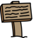

## サイン

今すぐあなたの世界にサインを追加して、プレイヤーを彼らの旅に導いてください。

あなたのプロジェクトには、 `ウェルカムサイン` スプライトが含まれてい` 。</p>

<p></p>

<p>--- task ---
 <code>ウェルカムサイン` スプライトはルーム1にのみ表示されるはずです そのため、スプライトにコードを追加してこれを確実に実行します。

\---ヒント\--- \---ヒント\--- `フラグがクリックされたとき`{：class = "block3events"}、永遠に ``{：class = "block3control"}ループ、 `なら`{：class = "block3control"} `部屋は1`{：class = "block3variables"}で、その場合は `show`{：class = "block3looks"} `ウェルカムサイン` スプライト、 `その他`{：class = "block3control"} `hide`{：class = "block3looks"}スプライト。 \--- / hint \--- \--- hint \--- 必要なブロックは次のとおりです。



```blocks3
<br />場合 &lt; &gt; 、次いで
他の
末端

&lt; （部屋::変数）= [1] &gt;

隠す

ショー

永久
の端部

フラグがクリックしたとき

```

\--- / hint \--- \--- hint \--- が完全なコードです。


```blocks3
flagが永遠に
クリックしたとき
 < （room :: variables）= [1] >
        >
    それ以外のとき
        隠す
    end
end
```

\--- / hint \--- \--- \--- / hints \---

- - /仕事 - -

\--- task \--- 部屋間を移動して、 `ウェルカムサイン` スプライトのコードをテストします。 看板は部屋1にだけ見えるはずです。

 - - /仕事 - -

\--- task \--- 何も言わなければサインはあまり良くありません！ `ウェルカムサイン` スプライトが `プレーヤー` スプライトに触れている場合にメッセージを表示するためのコードをさらに追加します。


```blocks3
flagが永遠に
クリックしたとき
 < （room :: variables）= [1] >
show
else
hide
end
+ < タッチしている場合（プレーヤーv） > それから
と言う[ようこそ！ あなたは宝物に得ることができますか？]
他
[]と言う
エンド
終了
```

- - /仕事 - -

\--- task \--- `ウェルカムサイン` スプライトをもう一度テストします。 `プレイヤー` スプライトが `ウェルカムサイン` スプライトに触れるとメッセージが表示されます。

 - - /仕事 - -