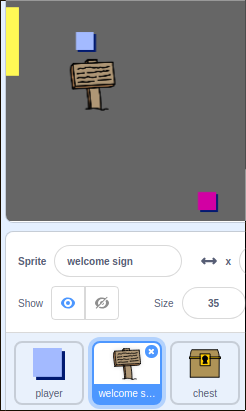

## サイン

あなたの世界に看板を入れて、プレイヤーの旅をガイドしましょう。

+ あなたのプロジェクトにはウェルカムサイン</code> スプライトが含まれてい `：</li>
</ul>

<p></p>

<ul>
<li><code>歓迎記号` スプライトは部屋1に表示され、これにいくつかのコードを追加する必要があります `歓迎看板` この問題が発生したことを確認するスプライト：

```blocks
    フラグを
    永遠に
 < （部屋）= [1] > 、次に

        その他


    終了
```

+ 部屋の間を移動することによって、あなたの `ウェルカムサイン` スプライトをテストしてください。 あなたの看板は部屋1にしか見えません。
    
    

+ それが何も言わないとサインはあまり良くない！ `ウェルカムサイン` スプライトが `プレイヤー` スプライトに触れている場合、メッセージを表示するコードをいくつか追加してください：

```blocks
    フラグが
    ときは永遠に
 < （部屋）= [1] > 次に
            場合
        else
            場合
        終了
        場合 < [player v]に触れる？ > から
            は[ようこそ！ あなたは宝に出ることができますか？]
        else
            say []
        end
    end
```

+ あなたの `歓迎サイン` スプライトを試してください - あなたは `プレイヤー` スプライトがそれに触れるとメッセージを表示するはずです。

