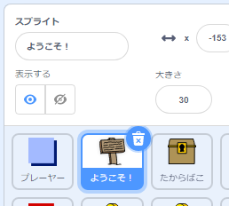
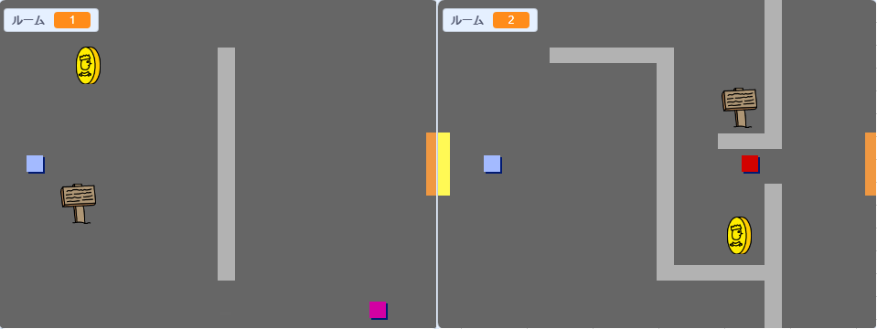
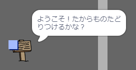

## サイン

ここで、プレイヤーを彼らの旅に導くためのサイン（みちしるべ）をあなたの「世界」に追加しましょう。

あなたのプロジェクトには、 `ようこそ！` スプライトが含まれています。



--- task ---

`ようこそ` スプライトは、部屋1にのみ表示されるはずなので、これを確実にするために、スプライトにコードを追加します。

--- hints ---

--- hint ---

`旗がクリックされたとき`{:class="block3events"}イベントについては、`無限ループ`{:class="block3control"} の中をみて、`もし`{:class="block3control"} `ルーム変数が１`{:class="block3variables"} の時には `ようこそ` スプライトを`表示`{:class="block3looks"}して, `そうでなければ`{:class="block3control"} `非表示`{:class="block3looks"} にする。

--- /hint --- 

--- hint ---

必要なブロックは次のとおりです。


```blocks3

if < > then
else
end

< (ルーム :: variables) = [1] >

hide

show

forever
end

when flag clicked

```

--- /hint --- 

--- hint ---

これが完成したプログラムです。


```blocks3
when flag clicked
forever
	if < (ルーム :: variables) = [1] > then
		show
	else
		hide
	end
end
```

--- /hint --- 

--- /hints ---

--- /task ---

--- task ---

あなたの `ようこそ！` スプライトのコードを、部屋の間を移動してテストしましょう。 標識はルーム1でのみ表示されなければなりません。



--- /task ---

--- task ---

標識は何も示していない（言わない）とするとはあまり良くありませんね! さらにコードを追加して`ようこそ！` スプライトが `プレーヤー` スプライトに触れた場合にメッセージを表示するようにしましょう。


```blocks3
when flag clicked
forever
if < (ルーム :: variables) = [1] > then
show
else
hide
end
+if < touching (プレーヤー v)? > then
say [ようこそ！ たからものにたどりつけるかな？]
else
say []
end
end
```

--- /task ---

--- task ---

`ようこそ！` スプライトをもう一度テストしましょう。 `プレイヤー` のスプライトが `ようこそ！` スプライトにさわったときに、メッセージが表示されるはずです。



--- /task ---