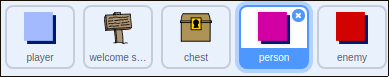

## 人

あなたの `プレイヤー` スプライトが相互作用できる他の人をあなたの世界に追加しましょう。

+ `人` スプライトに切り替えます。



+ `人の` スプライトにいくつかのコードを追加して、その人が `人の` スプライトと話すようにします。 このコードは、 `記号` スプライトに追加したコードと非常によく似ています。

```blocks
    フラグが
    ときx：（0）y：（-150）
    永遠に
 < [player v]に触れたら？ > と
            言う[あなたはオレンジとイエローのドアを通過できることを知っていましたか？]
        else
            say []
        end
    end
```

+ また、コードの `else`{：class = "blockcontrol"}セクションにこれら2つのブロックを追加することで、 `人の` スプライトを移動させることもできます`</li>
</ul>

<pre><code class="blocks">move（1）エッジの場合は
ステップ、バウンス
`</pre> 
    あなたの `人` スプライトは移動しますが、 `人の` スプライトと話すのを止めます。
    
    
    
    \---挑戦\---
    
    ### 課題：人を改善する
    
    新しい `人` スプライトにコードを追加して、ルーム1にしか表示されないようにすることはできますか？ 新しいコードをテストしてください。
    
    \--- /チャレンジ\---