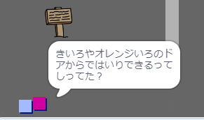

## 人

あなたの `プレイヤー` スプライトが相互作用できる他の人々をあなたの世界に追加しましょう。

\--- task \---

`人`のスプライトを選んでください。


\--- /task \---

\--- task \---

`人` スプライトにコードを追加して、その人が `プレーヤー` スプライトと会話できるようにします。 このコードは `標識（ようこそ！）` スプライトに追加したコードにとてもよく似ています。


```blocks3
旗がクリックされたとき
はxに行きます：（0）y：（-150）
永遠に
 < 触れたら
 （プレイヤーv） > その後、
        [あなたはオレンジと黄色のドアを通って行くことができることを知っていますか？]と言う
    他
        []と言う
    終了
終了
```

\--- /task \---

\--- task \---

コードの `そのほか` {:class="block3control"}セクションに2つのブロックを追加することで、 `人`スプライトを移動させることができます。


```blocks3
旗がクリックされたとき
はxに行きます：（0）y：（-150）
永遠に
 < 触れたら
 （プレイヤーv） > その後、
        [あなたはオレンジと黄色のドアを通って行くことができることを知っていますか？]と言う
    他
        []と言う
+移動が（1）の手順
端に、バウンス場合は+
    終了
終了を
```

\--- /task \---

`人` のスプライトは動きますが、 `プレイヤー` のスプライトと話すために立ち止まります。



\--- task \---

新しい `人` のスプライトがルーム1にのみ現れるようにコードを追加しましょう。 必要なコードは、 `標識（ようこそ！）` のスプライトをルーム1でのみ見えるようにするコードとまったく同じです。

新しいコードを必ずテストしてください。

\--- /task \---