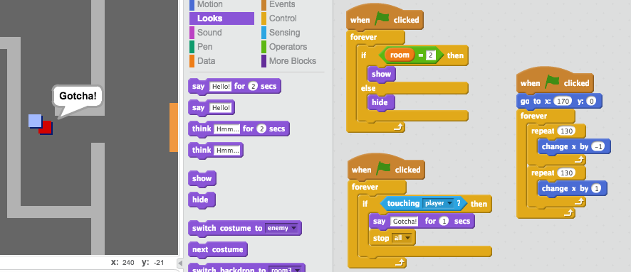

\---挑戦\---

## 課題：敵を追加する

巡回敵に追加することもできます。 プレイヤーが敵に触れると、ゲームは終了します。

+ `敵` スプライトにコードを追加して、部屋2にのみ表示されるようにします。

+ 移動するためにコードを追加します `敵` スプライトを、そして場合は、ゲームを終了する `敵` スプライトが触れた `選手` スプライトを。 別のコードブロックでこれを行う方が簡単です。 `敵` スプライトコードがどのように見えるかは次のとおりです。

+ + それは部屋2にしか見えません
    + それは部屋をパトロールする
    + あればゲームは終了 `プレイヤー` スプライトがそれに触れます

\--- /チャレンジ\---

\---挑戦\---

## 課題：より多くの敵

あなたは別の作成することができます `敵` 壁の隙間を通ってそのパトロール上下室3でスプライトを？

\--- /チャレンジ\---