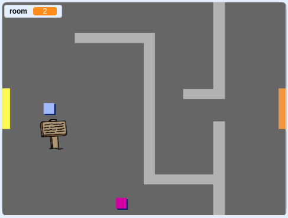

## ನಿಮ್ಮ ಪ್ರಪಂಚದಾದ್ಯಂತ ಸರಿಸಿ

`player` ಸ್ಪ್ರೈಟ್ ಬಾಗಿಲುಗಳ ಮೂಲಕ ಇತರ ಕೋಣೆಗಳಿಗೆ ಕಾಲಿಡಲು ಸಾಧ್ಯವಾಗುತ್ತದೆ.

ನಿಮ್ಮ ಪ್ರಾಜೆಕ್ಟ್ ಹೆಚ್ಚುವರಿ ಕೊಠಡಿಗಳಿಗಾಗಿ ಬ್ಯಾಕ್‌ಡ್ರಾಪ್‌ಗಳನ್ನು ಒಳಗೊಂಡಿದೆ:


--- task ---

ಹೊಸ 'ಎಲ್ಲಾ ಸ್ಪ್ರೈಟ್‌ಗಳಿಗೆ' ವೇರಿಯೇಬಲ್ ಅನ್ನು ರಚಿಸಿ `room`{:class="block3variables"} ಯಾವ ಕೋಣೆಯ ಬಗ್ಗೆ ನಿಗಾ ಇಡಲು `player` ಸ್ಪ್ರೈಟ್ ಇದೆಯ.

[[[generic-scratch3-add-variable]]]


--- /task ---

--- task ---

ಯಾವಾಗ `player` ಸ್ಪ್ರೈಟ್ ಮೊದಲ ಕೋಣೆಯಲ್ಲಿ ಕಿತ್ತಳೆ ಬಾಗಿಲನ್ನು ಮುಟ್ಟುತ್ತದೆ, ಆಟವು ಮುಂದಿನ ಹಿನ್ನೆಲೆಯನ್ನು ಪ್ರದರ್ಶಿಸಬೇಕು, ಮತ್ತು `player` ಸ್ಪ್ರೈಟ್ ಹಂತದ ಎಡಭಾಗಕ್ಕೆ ಹಿಂತಿರುಗಬೇಕು. ಒಳಗೆ ಈ ಕೋಡ್ ಸೇರಿಸಿ `player` ಸ್ಪ್ರೈಟ್ಸ್ `forever`{:class="block3control"} ಲೂಪ್:


```blocks3
when flag clicked
forever
    if <key (up arrow v) pressed? > then
        point in direction (0)
        move (4) steps
    end
    if <key (left arrow v) pressed? > then
        point in direction (-90)
        move (4) steps
    end
        if <key (down arrow v) pressed? > then
        point in direction (-180)
        move (4) steps
    end
        if <key [right arrow v] pressed? > then
        point in direction (90)
        move (4) steps
    end
    if < touching color [#BABABA]? > then
    move (-4) steps
    end
+   if < touching color [#F2A24A] > then
    switch backdrop to (next backdrop v)
    go to x: (-200) y: (0)
    change [room v] by (1)
    end
end
```

--- /task ---

--- task ---

ಆಟ ಪ್ರಾರಂಭವಾದಾಗಲೆಲ್ಲಾ ಕೊಠಡಿ, ಪಾತ್ರದ ಸ್ಥಾನ ಮತ್ತು ಹಿನ್ನೆಲೆ ಮರುಹೊಂದಿಸಬೇಕಾಗುತ್ತದೆ.

ಕೋಡ್ ಸೇರಿಸಿ **start** ನಿಮ್ಮ `player` ಮೇಲಿನ ಸ್ಪ್ರೈಟ್ ಕೋಡ್ `forever`{:class="block3control"} ಲೂಪ್ ಧ್ವಜ ಕ್ಲಿಕ್ ಮಾಡಿದಾಗ ಎಲ್ಲವನ್ನೂ ಮರುಹೊಂದಿಸಲು:

--- hints ---


--- hint ---

ಆಟ ಪ್ರಾರಂಭವಾದಾಗ:

+ ಮೌಲ್ಯದ `room`{:class="block3variables"} ಹೊಂದಿಸಬೇಕುದು `1`{:class="block3variables"}
+ `backdrop`{:class="block3looks"} ಹೊಂದಿಸಬೇಕು `room1`{:class="block3looks"}
+ ಸ್ಥಾನ `player` ಸ್ಪ್ರೈಟ್ ಅನ್ನು ಹೊಂದಿಸಬೇಕು `x: -200 y: 0`{:class="block3motion"}

--- /hint ---

--- hint ---

ನಿಮಗೆ ಅಗತ್ಯವಿರುವ ಹೆಚ್ಚುವರಿ ಬ್ಲಾಕ್‌ಗಳು ಇಲ್ಲಿವೆ:


```blocks3
go to x: (-200) y: (0)

set [room v] to (1)

switch backdrop to (room1 v)
```

--- /hint ---

--- hint ---

ನಿಮ್ಮ ಸಿದ್ಧಪಡಿಸಿದ ಸ್ಕ್ರಿಪ್ಟ್ ಹೇಗಿರಬೇಕು ಎಂಬುದು ಇಲ್ಲಿದೆ:


```blocks3
when flag clicked
+set [room v] to (1)
+go to x: (-200) y: (0)
+switch backdrop to (room1 v)
forever
    if <key (up arrow v) pressed? > then
        point in direction (0)
        move (4) steps
    end
    if <key (left arrow v) pressed? > then
        point in direction (-90)
        move (4) steps
    end
        if <key (down arrow v) pressed? > then
        point in direction (-180)
        move (4) steps
    end
        if <key [right arrow v] pressed? > then
        point in direction (90)
        move (4) steps
    end
    if < touching color [#BABABA]? > then
    move (-4) steps
    end
    if < touching color [#F2A24A] > then
    switch backdrop to (next backdrop v)
    go to x: (-200) y: (0)
    change [room v] by (1)
end
end
```

--- /hint ---

--- /hints ---

--- /task ---

--- task ---

ಧ್ವಜವನ್ನು ಕ್ಲಿಕ್ ಮಾಡಿ, ತದನಂತರ ನಿಮ್ಮದನ್ನು ಸರಿಸಿ `player` ಸ್ಪ್ರೈಟ್ ಕಿತ್ತಳೆ ಬಾಗಿಲನ್ನು ಮುಟ್ಟುವವರೆಗೆ. ಸ್ಪ್ರೈಟ್ ಮುಂದಿನ ಪರದೆಯತ್ತ ಚಲಿಸುತ್ತದೆಯೇ? ಮಾಡುತ್ತ `room`{:class="block3variables"} ವೇರಿಯಬಲ್ ಬದಲಾವಣೆ `2`?



--- /task ---