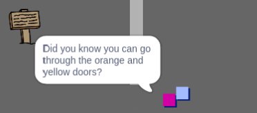

## ಜನರು

ನಿಮ್ಮ ಜಗತ್ತಿಗೆ ಇತರ ಜನರನ್ನು ಸೇರಿಸಿ `player` ಸ್ಪ್ರೈಟ್ ಸಂವಹನ ಮಾಡಬಹುದು.

\--- task \---

ಬದಲಾಯಿಸಿ `person` ಸ್ಪ್ರೈಟ್.


\--- /task \---

\--- task \---

ಕೆಲವು ಕೋಡ್ ಸೇರಿಸಿ `person` ಸ್ಪ್ರೈಟ್ ಆದ್ದರಿಂದ ವ್ಯಕ್ತಿಯು ಮಾತನಾಡುತ್ತಾನೆ `player` ಸ್ಪ್ರೈಟ್. ಈ ಕೋಡ್ ನಿಮ್ಮೊಂದಿಗೆ ನೀವು ಸೇರಿಸಿದ ಕೋಡ್‌ಗೆ ಹೋಲುತ್ತದೆ `sign` ಸ್ಪ್ರೈಟ್:


```blocks3
when flag clicked
go to x: (0) y: (-150)
forever
    if < touching (player v)? > then
        say [Did you know that you can go through orange and yellow doors?]
    else
        say []
    end
end
```

\--- /task \---

\--- task \---

ಅನುಮತಿಸಿ `person` ಸ್ಪ್ರೈಟ್ ಈ ಎರಡು ಬ್ಲಾಕ್ಗಳನ್ನು ಸೇರಿಸುವ ಮೂಲಕ ಚಲಿಸಲು `else`{:class="block3control"} ನಿಮ್ಮ ವಿಭಾಗದ ಕೋಡ್‌:


```blocks3
when flag clicked
go to x: (0) y: (-150)
forever
    if < touching (player v)? > then
        say [Did you know that you can go through orange and yellow doors?]
    else
        say []
+       move (1) steps
+       if on edge, bounce
    end
end
```

\--- /task \---

ನಿಮ್ಮ `person` ಸ್ಪ್ರೈಟ್ ಈಗ ಚಲಿಸುತ್ತದೆ, ಆದರೆ ಮಾತನಾಡಲು ನಿಲ್ಲುತ್ತದೆ `player` ಸ್ಪ್ರೈಟ್.



\--- task \---

ನಿಮ್ಮ ಹೊಸದಕ್ಕೆ ಕೋಡ್ ಸೇರಿಸಿ `person` ಸ್ಪ್ರೈಟ್ ಆದ್ದರಿಂದ ಸ್ಪ್ರೈಟ್ ಕೊಠಡಿ 1 ರಲ್ಲಿ ಮಾತ್ರ ಕಾಣಿಸಿಕೊಳ್ಳುತ್ತದೆ. ನಿಮಗೆ ಅಗತ್ಯವಿರುವ ಕೋಡ್ ನಿಖರವಾಗಿ ಮಾಡುವ ಕೋಡ್‌ನಂತೆಯೇ ಇರುತ್ತದೆ `sign` ಸ್ಪ್ರೈಟ್ ಕೊಠಡಿ 1 ರಲ್ಲಿ ಮಾತ್ರ ಗೋಚರಿಸುತ್ತದೆ.

ನಿಮ್ಮ ಹೊಸ ಕೋಡ್ ಅನ್ನು ನೀವು ಪರೀಕ್ಷಿಸುತ್ತಿದ್ದೀರಿ ಎಂದು ಖಚಿತಪಡಿಸಿಕೊಳ್ಳಿ.

\--- /task \---