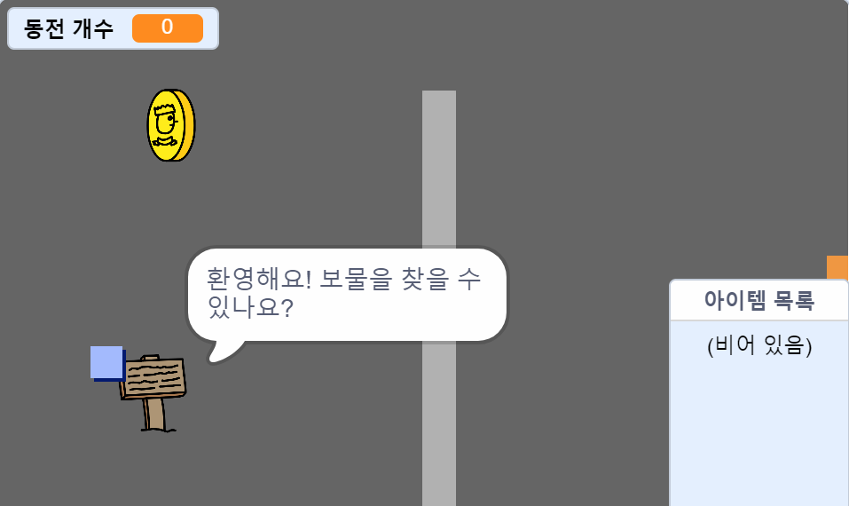

\--- no-print \---

This is the **Scratch 3** version of the project. There is also a [Scratch 2 version of the project](https://projects.raspberrypi.org/en/projects/create-your-own-world-scratch2).

\--- /no-print \---

## 들어가며

In this project, you'll learn how to create your own adventure game world with multiple levels to explore.

### 만들 작품

\--- no-print \---

Click the green flag to start. Use the arrow keys to move your character around in the world.

  <iframe allowtransparency="true" width="485" height="402" src="https://scratch.mit.edu/projects/embed/258757783/?autostart=false" frameborder="0" scrolling="no"></iframe>
  

\--- /no-print \---

\--- print-only \---

You'll use the arrow keys to move your character around in the world. 

\--- /print-only \---

## \--- collapse \---

## title: 준비물

### 하드웨어

- 스크래치 3을 실행할 수 있는 컴퓨터

### 소프트웨어

- 스크래치 3 ( [온라인](http://rpf.io/scratchon){:target="_ blank"} 또는 [offline](http://rpf.io/scratchoff){:target="_ blank"})

### Downloads

You can find everything you need to complete this project at [rpf.io/p/en/create-your-own-world-go](https://rpf.io/p/en/create-your-own-world-go).

\--- /collapse \---

## \--- collapse \---

## title: 배우게 될 것

- Use conditional selection to react to key presses
- Use variables to store a game's state
- Use conditional selection based on the value of a variable
- Use lists to store data

\--- /collapse \---

## \--- collapse \---

## title: Additional information for educators

이 프로젝트를 인쇄한다면 [프린트용 버전](https://projects.raspberrypi.org/en/projects/create-your-own-world/print){:target="_blank"}을 사용해 주십시오.

You can find the solutions to this project at [rpf.io/p/en/create-your-own-world-get](https://rpf.io/p/en/create-your-own-world-get).

\--- /collapse \---