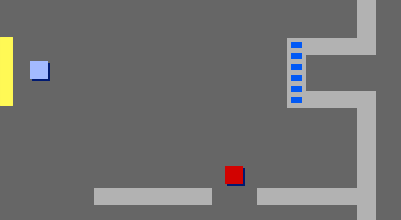

## 문과 열쇠

이제 코드를 추가해 게임에서 몇개의 문이 잠기게 할 것이고 플레이어는 잠긴 문을 열어 다음 방으로 진입하기 위해 열쇠를 찾아야 합니다.

\--- task \---

`열쇠` 스프라이트로 갑니다. 해당 스크립트 내 `보이기`{:class="blocklooks"} 를 클릭해 해당 스프라이트가 스테이지에 나타나게 합니다.

\--- /task \---

\--- task \---

`열쇠` 스프라이트의 코스튬을 편집해 색상이 파란색이 되게 합니다.

\--- /task \---

\--- task \---

스테이지 배경을 방3으로 전환하고 `열쇠` 스프라이트를 도달하기 어려운 곳에 놓으세요!


\--- /task \---

\--- task \---

`열쇠` 스프라이트에 코드를 추가해 그것이 방3에서만 나타나게 합니다.

\--- /task \---

\--- task \---

`플레이어` 스프라이트가 수집하는 아이템들을 저장하도록 `인벤토리`{:class="block3variables"} 라는 새로운 리스트를 만듭니다.

[[[generic-scratch3-make-list]]]

\--- /task \---

\--- task \---

열쇠 줍기를 위해 추가하는 코드는 동전 수집을 위한 코드와 매우 유사합니다. 차이점은 열쇠를 `인벤토리`{:class="block3variables"} 에 추가하는 점입니다.


```blocks3
when flag clicked
wait until <touching (player v)?>
add [blue key] to [inventory v]
hide
stop [other scripts in sprite v]
```

\--- /task \---

\--- task \---

게임 시작 시 인벤토리가 비워지게 스테이지에 코드를 추가합니다.

```blocks3
delete all of [inventory v]
```

\--- /task \---

\--- task \---

게임 테스트를 통해 `열쇠` 스프라이트를 수집하고 이것을 인벤토리에 추가할 수 있는지 여부를 확인하세요.

\--- /task \---

\--- task \---

이제 잠긴 문을 추가하세요. `문-파란색` 스프라이트를 선택하고 스크립트 메뉴의 `보이기`{:class="blocklooks} 를 클릭 후 해당 스프라이트를 두 벽 사이에 위치시키세요.



\--- /task \---

\--- task \---

`문-파란색` 스프라이트에 코드를 추가해 그것이 방3에서만 보여지게 합니다.

\--- /task \---

\--- task \---

`문-파란색` 스프라이트에 코드를 추가해 열쇠가 `인벤토리`{:class="block3variables"} 에 있을 경우 해당 스프라이트가 `숨기기`{:class="block3looks"} 되어 `플레이어` 스프라이트가 지나가도록 합니다.


```blocks3
when flag clicked
wait until <[inventory v] contains [blue key]?>
stop [other scripts in sprite v]
hide
```

\--- /task \---

\--- task \---

게임 테스트를 통해 파란 열쇠를 수집하여 문을 열 수 있는지 확인합니다!

\--- /task \---