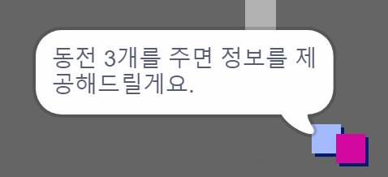
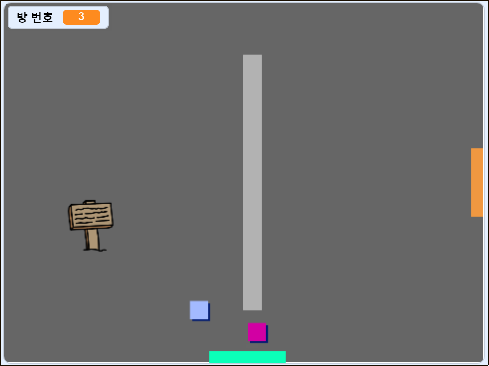

## 도전 과제: 나만의 방 만들기

이제 나만의 세상을 계속 만들 수 있습니다! 몇 가지 아이디어를 제시해 드릴게요:

+ 다른 방에서 게임에 더 많은 동전을 추가하세요. 적을 순찰하게 하여 동전을 지키도록 할 수 있나요?
+ 게임 배경을 변경해봅니다
+ 소리나 음악을 추가해봅니다
+ 더 많은 사람, 적, 표지판을 추가해봅니다.
+ 빨간색과 노란색 문을 추가하고, 특별한 열쇠로 열리게 합니다.
+ 맵에 더 많은 방을 만들어봅니다.
+ 더 많은 유용한 아이템을 추가합니다.
    
    + 코인을 이용하여 다른 사람들로부터 정보를 얻을 수 있게 합니다:



+ 방1의 북쪽과 남쪽에도 문을 달아 플레이어가 모든 방향으로 방을 드나들 수 있게끔 할 수도 있습니다. 예컨대, 9개의 방을 3x3짜리 격자 모양으로 배치할 수도 있습니다. 그렇게 한 다음 방 번호에 `3`을 더해 아래로 층수를 이동하는 것으로 할 수도 있습니다.




```blocks3
if <touching color [ ]?> then
switch backdrop to ((costume [number v]) + (3))
go to x:(0) y:(200)
change [방 v] by (3)
```