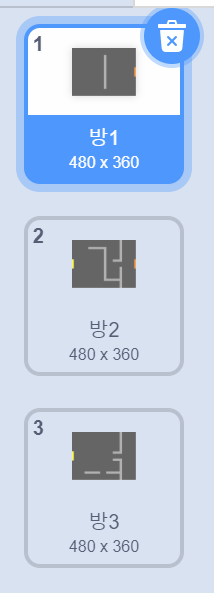
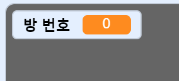
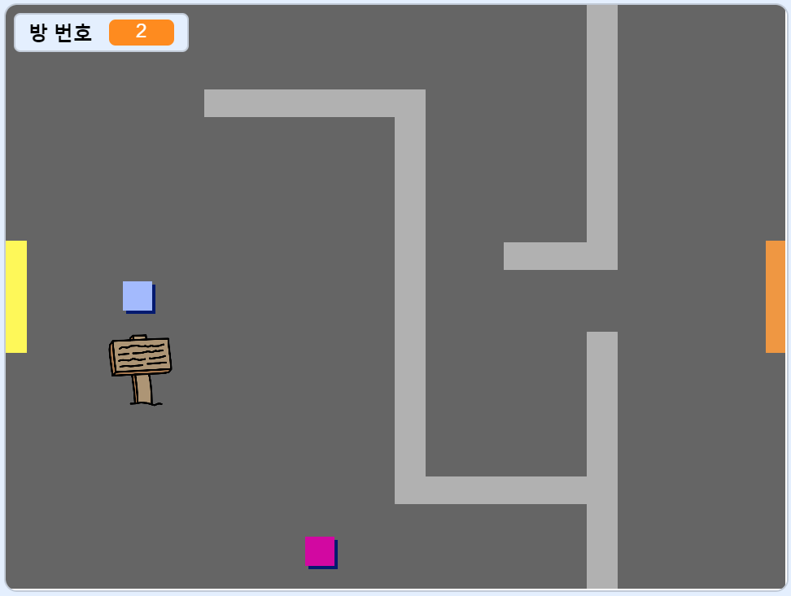

## 맵에서 이동하기

`플레이어` 스프라이트는 문을 통과하여 다른 방으로 걸어 들어갈 수 있어야 합니다.

이 프로젝트는 추가적인 방에 대한 배경을 포함합니다.



\--- task \---

`방` 이란 명칭의 '모든 스프라이트에 적용' 되는 새로운 변수를 만들어 `플레이어` 스프라이트가 있는 방을 추적해 봅니다.

[[[generic-scratch3-add-variable]]]



\--- /task \---

\--- task \---

`플레이어` 스프라이트가 첫째 방의 주황색 문에 닿으면 게임은 다음 배경을 보여주고 `플레이어` 스프라이트는 다시 스테이지 왼쪽으로 이동합니다. `플레이어` 스프라이트의 `무한반복`{:class="block3control"} 루프 네에 다음의 코드를 추가합니다:


```blocks3
깃발이 클릭되었을 때
무한반복 
  만약 <키 (위쪽 화살표 v) 를 누른 상태라면? > 이라면
   (0) 도 방향 보기
   (4) 스텝 이동
  종료
  만약 <키 (왼쪽 화살표 v) 를 누른 상태라면? > 이라면
        (-90) 도 방향 보기
        (4) 스텝 움직이기
    종료
        만약 <키 (아래쪽 화살표 v) 를 누른 상태라면? when flag clicked
+set [방 번호 v] to (1)
+go to x: (-200) y: (0)
+switch backdrop to (방1 v)
forever
    if <key (up arrow v) pressed? > 이라면
        (90) 도 방향 보기
        (4) 스텝 이동
    종료
    만약 < 가 [#BABABA] 색상에 닿으면? > 이면
  (-4) 스텝 이동
  종료
+  만약 < [#F2A24A] 색상에 닿는 > 다면
  배경을 (다음 배경 v) 으로 전환
  x: (-200) y: (0) 으로 이동
  [방 v] 을 (1) 만큼 변경
  종료
종료
```

\--- /task \---

\--- task \---

게임이 시작될 때마다 방, 캐릭터 위치, 배경이 초기화되어야 합니다.

`무한반복`{:class="block3control"} 루프 위의 `플레이어` 스프라이트의 **시작** 부분에 코드를 추가해 플래그 클릭 시 모든게 초기화되도록 하세요:

\--- hints \---

\--- hint \---

게임이 시작되면:

+ `방`{:class="block3variables"} 의 값이 `1`{:class="block3variables"} 로 설정되야 합니다
+ `배경`{:class="block3looks"} 은 `방1`{:class="block3looks"} 로 설정되야 합니다
+ `플레이어` 스프라이트의 위치가 `x: -200 y: 0`{:class="block3motion"} 으로 설정되어야 합니다.

\--- /hint \---

\--- hint \---

추가로 필요한 블록은 다음과 같습니다:


```blocks3
x: (-200) y: (0) 으로 이동

[방 v] 을 (1) 로 설정

배경을 (방1 v) 으로 전환
```

\--- /hint \---

\--- hint \---

완성된 스크립트는 다음과 같아야 합니다:


```blocks3
깃발이 클릭되었을 때
+[방 v] 을 (1) 로 설정
+x: (-200) y: (0) 으로 이동
+배경을 (방1 v) 으로 이동
무한반복
    만약 <키 (위쪽 화살표 v) 를 누른 상태라면? > 이라면
   (0) 도 방향 보기
   (4) 스텝 이동
  종료
  만약 <키 (왼쪽 화살표 v) 를 누른 상태라면? > 이라면
        (-90) 도 방향 보기
        (4) 스텝 이동
    종료
        만약 <키 (아래쪽 화살표 v) 를 누른 상태라면? when flag clicked
forever
    if <key (up arrow v) pressed? > 이라면
        (90) 도 방향 보기
        (4) 스텝 이동
    종료
    만약 < 가 [#BABABA] 색상에 닿으면? > 이라면
  (-4) 스텝 이동
  종료
  만약 < [#F2A24A] 색상에 닿는 > 다면
  배경을 (다음 배경 v) 으로 전환
  x: (-200) y: (0) 으로 이동
  [방 v] 을 (1) 만큼 변경
종료
종료
```

\--- /hint \---

\--- /hints \---

\--- /task \---

\--- task \---

깃발을 클릭한 후 `플레이어` 스프라이트를 주황색 문에 닿을 때까지 이동시킵니다. 스프라이트가 다음 스크린으로 이동하나요? `방`{:class="block3variables"} 변수가 `2`로 변하나요?



\--- /task \---