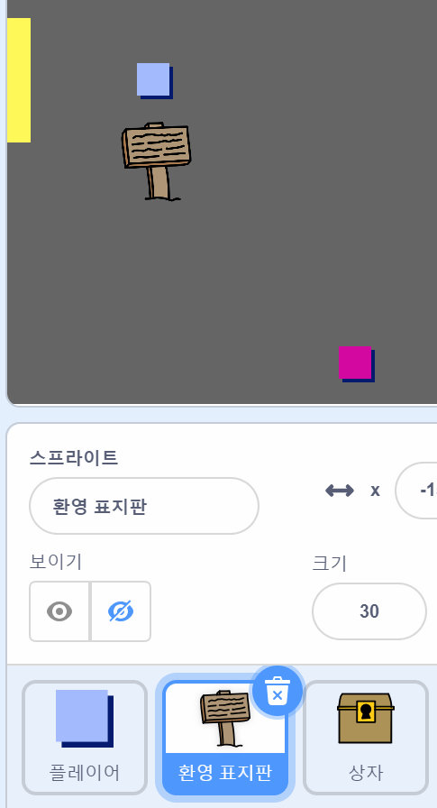
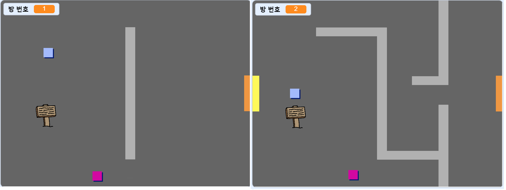
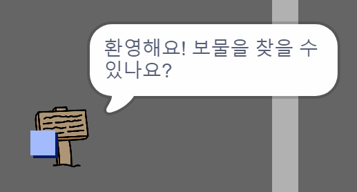

## 표지판 만들기

이제 표지판을 추가하여 플레이어의 여행을 안내해봅시다.

이 프로젝트는 `환영 표지판` 스프라이트를 포함하고 있습니다:



--- task ---

`환영 표지판` 스프라이트는 방1에서만 볼 수 있어야 하므로, 스프라이트에 코드를 추가하여 잘 작동하게 합니다:

--- hints ---


--- hint ---

`깃발을 클릭했을 때`{:class="block3events"}, `무한 반복하기`{:class="block3control"} 블록 안에서 `방 번호가 1`{:class="block3variables"}인지 확인한 후, `만약 그렇다면`{:class="block3control"} `환영 표지판` 스프라이트를 `보이기`{:class="block3looks"}하고, 아니라면 스프라이트를 `숨기기`{:class="block3looks"} 하세요.

--- /hint ---

--- hint ---

필요한 블록은 다음과 같습니다.


```blocks3
if < > then
else
end

< (방 번호 :: variables) = [1] >

hide

show

forever
end

when flag clicked

```

--- /hint ---

--- hint ---

완성된 코드는 다음과 같습니다:


```blocks3
when flag clicked
forever
    if < (방 번호 :: variables) = [1] > then
        show
    else
        hide
    end
end
```

--- /hint ---

--- /hints ---

--- /task ---

--- task ---

방 사이를 오가면서 `환영 표지판`에 대한 코드를 테스트하세요. 표지판은 방1에서만 보여야 합니다.



--- /task ---

--- task ---

하지만 아무 말도 하지 않는다면 표지판은 소용이 없을 것입니다! 코드를 추가하여 `환영 표지판` 스프라이트가 `플레이어` 스프라이트에 접촉했을 때 메세지가 표시되게끔 해봅시다:


```blocks3
when flag clicked
forever
if < (방 번호 :: variables) = [1] > then
show
else
hide
end
+if < touching (플레이어 v)? > then
say [환영합니다! 보물을 찾을 수 있나요?]
else
say []
end
end
```

--- /task ---

--- task ---

`환영 표지판`을 다시 테스트해보세요. 이제는 `플레이어` 스프라이트가 `환영 표지판` 스프라이트에 닿으면 메세지가 보여야 합니다.



--- /task ---