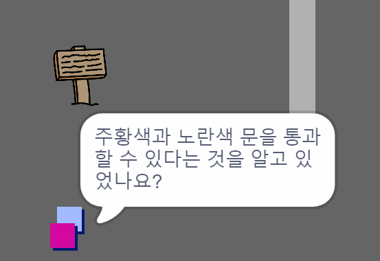

## 사람

Add other people to your world who your `player` sprite can interact with.

\--- task \---

`개인` 스프라이트로 전환합니다.


\--- /task \---

\--- task \---

`개인` 스프라이트에 코드를 추가해 `플레이어` 스프라이트에게 말을 하게 합니다. 이것은 `표지판` 스프라이트에 추가했던 코드와 매우 유사합니다:


```blocks3
when flag clicked
go to x: (0) y: (-150)
forever
    if < touching (player v)? > then
        say [Did you know that you can go through orange and yellow doors?]
    else
        say []
    end
end
```

\--- /task \---

\--- task \---

코드의 `만약 아니라면` 섹션 내에 두개의 블록을 추가해 `개인` 스프라이트가 움직이게 해줍니다:


```blocks3
when flag clicked
go to x: (0) y: (-150)
forever
    if < touching (player v)? > then
        say [Did you know that you can go through orange and yellow doors?]
    else
        say []
+       move (1) steps
+       if on edge, bounce
    end
end
```

\--- /task \---

이제 `개인` 스프라이트는 움직일 것이고 `플레이어` 스프라이트에 말을 걸 때는 멈출 것입니다.



\--- task \---

새로운 `개인` 스프라이트에 코드를 추가해 그것이 방1에서만 나타나게 합니다. 이에 필요한 코드는 `표지판` 스프라이트가 방1에서만 보이게 하는 코드와 정확히 일치합니다.

새 코드를 반드시 테스트하세요.

\--- /task \---